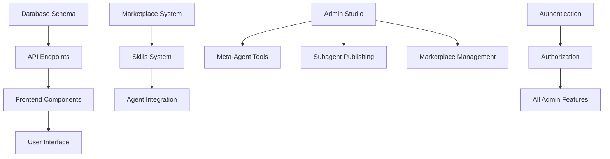

# Chronos AI Agent Builder Studio - Implementation Quick Reference

## Quick Checklist of All Files to Create/Modify

### Backend Files

#### API Endpoints

- [`backend/app/api/skills.py`](backend/app/api/skills.py) - Skills management endpoints
- [`backend/app/api/platform_updates.py`](backend/app/api/platform_updates.py) - Platform updates CRUD
- [`backend/app/api/support.py`](backend/app/api/support.py) - Support messaging system
- [`backend/app/api/payments.py`](backend/app/api/payments.py) - Payment settings management
- [`backend/app/api/admin_analytics.py`](backend/app/api/admin_analytics.py) - Admin analytics and monitoring
- [`backend/app/api/marketplace_admin.py`](backend/app/api/marketplace_admin.py) - Marketplace moderation endpoints

#### Models and Schemas

- [`backend/app/models/skills.py`](backend/app/models/skills.py) - Skills models (already exists)
- [`backend/app/models/platform_updates.py`](backend/app/models/platform_updates.py) - Platform updates models (already exists)
- [`backend/app/models/support.py`](backend/app/models/support.py) - Support models (already exists)
- [`backend/app/models/payments.py`](backend/app/models/payments.py) - Payment models (already exists)
- [`backend/app/schemas/skills.py`](backend/app/schemas/skills.py) - Skills schemas
- [`backend/app/schemas/platform_updates.py`](backend/app/schemas/platform_updates.py) - Platform updates schemas
- [`backend/app/schemas/support.py`](backend/app/schemas/support.py) - Support schemas
- [`backend/app/schemas/payments.py`](backend/app/schemas/payments.py) - Payment schemas

#### Skills Directory Structure

```
backend/skills/
├── analysis/
│   ├── web_search/
│   │   ├── skill.json
│   │   ├── main.py
│   │   ├── requirements.txt
│   │   └── README.md
│   └── data_analysis/
│       ├── skill.json
│       └── analyzer.py
├── automation/
│   ├── workflow_builder/
│   │   ├── skill.json
│   │   └── builder.py
│   └── task_automation/
│       ├── skill.json
│       └── automator.py
└── communication/
    ├── email_handler/
    │   ├── skill.json
    │   └── email.py
    └── chat_enhancer/
        ├── skill.json
        └── chat.py
```

### Frontend Files

#### Admin Studio Components

- [`frontend/src/components/admin/AdminStudio.tsx`](frontend/src/components/admin/AdminStudio.tsx) - Main admin studio component
- [`frontend/src/components/admin/AdminNavigation.tsx`](frontend/src/components/admin/AdminNavigation.tsx) - Admin navigation
- [`frontend/src/components/admin/AdminDashboard.tsx`](frontend/src/components/admin/AdminDashboard.tsx) - Admin dashboard
- [`frontend/src/components/admin/meta-agent/MetaAgentStudio.tsx`](frontend/src/components/admin/meta-agent/MetaAgentStudio.tsx) - Meta-agent studio
- [`frontend/src/components/admin/meta-agent/FuzzyToolsPanel.tsx`](frontend/src/components/admin/meta-agent/FuzzyToolsPanel.tsx) - FUZZY tools panel
- [`frontend/src/components/admin/meta-agent/FuzzyCommandHistory.tsx`](frontend/src/components/admin/meta-agent/FuzzyCommandHistory.tsx) - Command history
- [`frontend/src/components/admin/subagent/SubagentStudio.tsx`](frontend/src/components/admin/subagent/SubagentStudio.tsx) - Subagent studio
- [`frontend/src/components/admin/subagent/SubagentPublisher.tsx`](frontend/src/components/admin/subagent/SubagentPublisher.tsx) - Subagent publishing
- [`frontend/src/components/admin/marketplace/MarketplaceAdmin.tsx`](frontend/src/components/admin/marketplace/MarketplaceAdmin.tsx) - Marketplace admin
- [`frontend/src/components/admin/marketplace/ModerationQueue.tsx`](frontend/src/components/admin/marketplace/ModerationQueue.tsx) - Moderation queue
- [`frontend/src/components/admin/skills/SkillsAdmin.tsx`](frontend/src/components/admin/skills/SkillsAdmin.tsx) - Skills admin
- [`frontend/src/components/admin/skills/SkillCreator.tsx`](frontend/src/components/admin/skills/SkillCreator.tsx) - Skill creator
- [`frontend/src/components/admin/platform/PlatformAdmin.tsx`](frontend/src/components/admin/platform/PlatformAdmin.tsx) - Platform admin
- [`frontend/src/components/admin/platform/UpdateCreator.tsx`](frontend/src/components/admin/platform/UpdateCreator.tsx) - Update creator
- [`frontend/src/components/admin/support/SupportAdmin.tsx`](frontend/src/components/admin/support/SupportAdmin.tsx) - Support admin
- [`frontend/src/components/admin/payments/PaymentsAdmin.tsx`](frontend/src/components/admin/payments/PaymentsAdmin.tsx) - Payments admin

#### User Studio Components

- [`frontend/src/components/studio/MarketplaceBrowser.tsx`](frontend/src/components/studio/MarketplaceBrowser.tsx) - Marketplace browser
- [`frontend/src/components/studio/MarketplaceListingCard.tsx`](frontend/src/components/studio/MarketplaceListingCard.tsx) - Listing card
- [`frontend/src/components/studio/MarketplaceDetails.tsx`](frontend/src/components/studio/MarketplaceDetails.tsx) - Listing details
- [`frontend/src/components/studio/SkillsPanel.tsx`](frontend/src/components/studio/SkillsPanel.tsx) - Skills panel
- [`frontend/src/components/studio/SkillCard.tsx`](frontend/src/components/studio/SkillCard.tsx) - Skill card
- [`frontend/src/components/studio/PlatformUpdates.tsx`](frontend/src/components/studio/PlatformUpdates.tsx) - Platform updates
- [`frontend/src/components/studio/PublishedAgents.tsx`](frontend/src/components/studio/PublishedAgents.tsx) - Published agents management

### Key Integration Points with Existing Code

#### Backend Integrations

1. **Marketplace Integration**
   - Integrate with existing [`backend/app/models/marketplace.py`](backend/app/models/marketplace.py)
   - Extend existing [`backend/app/schemas/marketplace.py`](backend/app/schemas/marketplace.py)
   - Use existing marketplace database tables

2. **Meta-Agent Integration**
   - Extend existing [`backend/app/core/meta_agent_engine.py`](backend/app/core/meta_agent_engine.py)
   - Add FUZZY tools to existing intent patterns
   - Integrate with existing meta-agent models

3. **Agent Integration**
   - Extend existing [`backend/app/models/agent.py`](backend/app/models/agent.py) for subagent support
   - Add skills relationship to agent model
   - Integrate with existing agent APIs

#### Frontend Integrations

1. **Studio Integration**
   - Add marketplace tab to existing studio navigation
   - Integrate skills panel with existing tools panel
   - Add platform updates to existing login flow

2. **Admin Integration**
   - Create new admin section with mode switching
   - Integrate with existing authentication system
   - Add admin-only routes and permissions

### Critical Dependencies Between Features



### Implementation Priority Matrix

| Priority | Feature | Dependencies |
|----------|---------|--------------|
| P0 | Database Schema | None |
| P0 | API Authentication | Database |
| P1 | Marketplace API | Database, Auth |
| P1 | Marketplace UI | Marketplace API |
| P1 | Admin Studio Framework | Auth |
| P2 | Skills System | Database, Auth |
| P2 | Meta-Agent Tools | Admin Framework, Auth |
| P2 | Subagent Publishing | Marketplace, Admin Framework |
| P3 | Platform Updates | Database, Auth |
| P3 | Support System | Database, Auth |
| P3 | Payment System | Database, Auth |
| P4 | Analytics Dashboard | All other systems |

### Quick Start Implementation Guide

1. **Setup Database**
   - Run existing marketplace, skills, platform updates, support, and payment migrations
   - Verify all tables are created correctly

2. **Implement Core API**
   - Create skills management endpoints
   - Create platform updates endpoints
   - Create support messaging endpoints
   - Create payment settings endpoints

3. **Build Admin Framework**
   - Create admin studio layout with navigation
   - Implement mode switching
   - Add authentication and authorization

4. **Implement Marketplace**
   - Create marketplace browsing UI
   - Implement installation workflow
   - Add publishing functionality

5. **Add Skills System**
   - Create skills directory structure
   - Implement skills browsing and installation
   - Add admin skills management

6. **Enhance Meta-Agent**
   - Add FUZZY studio manipulation tools
   - Integrate with existing meta-agent engine
   - Create testing interface

7. **Add Platform Features**
   - Implement platform updates
   - Add support messaging
   - Configure payment settings

8. **Testing and Optimization**
   - Write integration tests
   - Perform security audit
   - Optimize performance

### Common Pitfalls and Solutions

1. **Authentication Issues**
   - Problem: Admin routes accessible to regular users
   - Solution: Implement RBAC middleware for all admin endpoints

2. **Performance Problems**
   - Problem: Slow marketplace searches
   - Solution: Add database indexes and implement caching

3. **Integration Conflicts**
   - Problem: Skills conflicting with existing tools
   - Solution: Implement dependency validation and sandboxing

4. **Permission Errors**
   - Problem: FUZZY unable to perform admin actions
   - Solution: Ensure FUZZY has proper admin permissions

5. **Media Handling**
   - Problem: Large media files in platform updates
   - Solution: Implement CDN integration and file size limits

### Debugging Checklist

- [ ] Verify all database migrations ran successfully
- [ ] Check API endpoint permissions and authentication
- [ ] Test marketplace installation workflow end-to-end
- [ ] Validate skills file structure and definitions
- [ ] Confirm FUZZY tools have proper API access
- [ ] Test admin mode switching functionality
- [ ] Verify platform updates display correctly
- [ ] Check support messaging notification system
- [ ] Validate payment settings configuration
- [ ] Test analytics dashboard data sources

### Deployment Checklist

- [ ] Run all database migrations
- [ ] Set up CDN for marketplace media
- [ ] Configure email notifications for support system
- [ ] Set up payment provider integrations
- [ ] Configure analytics tracking
- [ ] Set up monitoring and logging
- [ ] Implement backup strategy for marketplace data
- [ ] Configure rate limiting for public endpoints
- [ ] Set up security headers and HTTPS
- [ ] Perform load testing on marketplace search

This quick reference guide provides a comprehensive overview of all implementation tasks, their dependencies, and key considerations for successful deployment.
