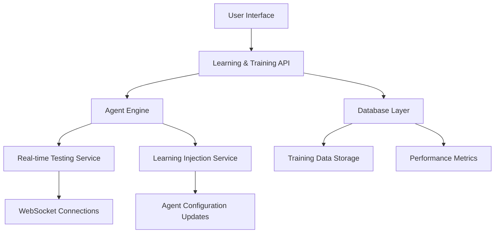

# Chronos AI Agent Builder Studio - Learning & Training System Plan

## Executive Summary

The Learning & Training System is a critical component of Sprint 33-36 that enables agents to improve through real-time testing, data collection, iterative learning, and performance analytics. This system will empower users to refine their agents' behavior and enhance their capabilities continuously.

## System Overview

### Key Deliverables

1. **Real-time Testing Interface** - Live agent testing and debugging capabilities
2. **Training Data Collection** - Comprehensive data gathering and management system
3. **Iterative Learning System** - Feedback loop for continuous agent improvement
4. **Performance Analytics** - Comprehensive analytics dashboard and reporting

### Core Features

- Live agent testing with real-time response visualization
- Correction and improvement interface for user feedback
- Learning injection system for incorporating improvements
- Comprehensive analytics dashboard with performance metrics
- Training data management and versioning
- Integration with existing agent workflows

## Technical Architecture

### High-Level System Design



### Component Architecture

```
┌─────────────────────────────────────────────────────────────────┐
│                    Learning & Training System                   │
├─────────────────────────────────────────────────────────────────┤
│  ┌─────────────────┐ ┌─────────────────┐ ┌─────────────────┐    │
│  │ Real-time       │ │ Training Data   │ │ Performance     │    │
│  │ Testing         │ │ Collection      │ │ Analytics       │    │
│  │                 │ │                 │ │                 │    │
│  │ • Live chat     │ │ • Data capture  │ │ • Metrics       │    │
│  │ • Debug tools   │ │ • Storage       │ │ • Visualization │    │
│  │ • Inspection    │ │ • Versioning    │ │ • Reporting     │    │
│  └─────────────────┘ └─────────────────┘ └─────────────────┘    │
├─────────────────────────────────────────────────────────────────┤
│  ┌─────────────────┐ ┌─────────────────┐ ┌─────────────────┐    │
│  │ Iterative       │ │ Integration     │ │ User Interface  │    │
│  │ Learning        │ │ Layer           │ │ Components      │    │
│  │                 │ │                 │ │                 │    │
│  │ • Feedback loop │ │ • Agent Engine  │ │ • Testing Panel │    │
│  │ • Learning      │ │ • Database      │ │ • Analytics     │    │
│  │ • Improvement   │ │ • Existing      │ │ • Training      │    │
│  │   tracking      │ │   Systems       │ │   Interface    │    │
│  └─────────────────┘ └─────────────────┘ └─────────────────┘    │
└─────────────────────────────────────────────────────────────────┘
```

### Integration Points

The Learning & Training System integrates with:

1. **Agent Engine** - For real-time agent execution and testing
2. **Database Layer** - For storing training data and performance metrics
3. **WebSocket Service** - For real-time communication and updates
4. **User Interface** - For displaying testing results and analytics
5. **Version Control** - For tracking agent improvements over time

## Database Schema Requirements

### New Tables Required

```sql
-- Training sessions table
CREATE TABLE training_sessions (
    id UUID PRIMARY KEY,
    agent_id UUID REFERENCES agents(id),
    user_id UUID REFERENCES users(id),
    session_name VARCHAR(255),
    started_at TIMESTAMP DEFAULT CURRENT_TIMESTAMP,
    ended_at TIMESTAMP,
    status VARCHAR(50) DEFAULT 'active', -- 'active', 'completed', 'aborted'
    configuration JSONB,
    created_at TIMESTAMP DEFAULT CURRENT_TIMESTAMP,
    updated_at TIMESTAMP DEFAULT CURRENT_TIMESTAMP
);

-- Training interactions table
CREATE TABLE training_interactions (
    id UUID PRIMARY KEY,
    session_id UUID REFERENCES training_sessions(id),
    interaction_order INTEGER NOT NULL,
    user_input TEXT NOT NULL,
    agent_response TEXT,
    response_time_ms INTEGER,
    created_at TIMESTAMP DEFAULT CURRENT_TIMESTAMP,
    metadata JSONB
);

-- Training corrections table
CREATE TABLE training_corrections (
    id UUID PRIMARY KEY,
    interaction_id UUID REFERENCES training_interactions(id),
    correction_type VARCHAR(50) NOT NULL, -- 'response', 'behavior', 'knowledge'
    original_content TEXT,
    corrected_content TEXT NOT NULL,
    improvement_notes TEXT,
    created_at TIMESTAMP DEFAULT CURRENT_TIMESTAMP,
    applied_at TIMESTAMP,
    status VARCHAR(50) DEFAULT 'pending' -- 'pending', 'applied', 'rejected'
);

-- Performance metrics table
CREATE TABLE performance_metrics (
    id UUID PRIMARY KEY,
    agent_id UUID REFERENCES agents(id),
    metric_type VARCHAR(50) NOT NULL, -- 'response_time', 'accuracy', 'user_satisfaction'
    metric_value FLOAT NOT NULL,
    recorded_at TIMESTAMP DEFAULT CURRENT_TIMESTAMP,
    context JSONB,
    created_at TIMESTAMP DEFAULT CURRENT_TIMESTAMP
);

-- Learning injections table
CREATE TABLE learning_injections (
    id UUID PRIMARY KEY,
    agent_id UUID REFERENCES agents(id),
    session_id UUID REFERENCES training_sessions(id),
    injection_type VARCHAR(50) NOT NULL, -- 'knowledge', 'behavior', 'correction'
    content TEXT NOT NULL,
    source VARCHAR(50), -- 'user', 'system', 'automated'
    status VARCHAR(50) DEFAULT 'pending', -- 'pending', 'applied', 'failed'
    applied_at TIMESTAMP,
    created_at TIMESTAMP DEFAULT CURRENT_TIMESTAMP,
    updated_at TIMESTAMP DEFAULT CURRENT_TIMESTAMP
);

-- Training data versions table
CREATE TABLE training_data_versions (
    id UUID PRIMARY KEY,
    agent_id UUID REFERENCES agents(id),
    version_number INTEGER NOT NULL,
    training_data JSONB NOT NULL,
    changelog TEXT,
    created_at TIMESTAMP DEFAULT CURRENT_TIMESTAMP,
    created_by UUID REFERENCES users(id)
);
```

### Database Indexes Required

```sql
-- Indexes for performance optimization
CREATE INDEX idx_training_sessions_agent ON training_sessions(agent_id);
CREATE INDEX idx_training_sessions_user ON training_sessions(user_id);
CREATE INDEX idx_training_interactions_session ON training_interactions(session_id);
CREATE INDEX idx_training_corrections_interaction ON training_corrections(interaction_id);
CREATE INDEX idx_performance_metrics_agent ON performance_metrics(agent_id);
CREATE INDEX idx_learning_injections_agent ON learning_injections(agent_id);
CREATE INDEX idx_training_data_versions_agent ON training_data_versions(agent_id);
```

## API Endpoints Needed

### Training Sessions Endpoints

```
# Training Sessions Management
POST /agents/{agent_id}/training/sessions
  - Create a new training session
  - Request: { "session_name": "string", "configuration": {} }
  - Response: { "session_id": "uuid", "status": "string" }

GET /agents/{agent_id}/training/sessions
  - List all training sessions for an agent
  - Response: [ { "session_id": "uuid", "session_name": "string", "status": "string", "started_at": "datetime" } ]

GET /agents/{agent_id}/training/sessions/{session_id}
  - Get details of a specific training session
  - Response: { "session_id": "uuid", "session_name": "string", "status": "string", "started_at": "datetime", "ended_at": "datetime", "configuration": {} }

PUT /agents/{agent_id}/training/sessions/{session_id}
  - Update training session details
  - Request: { "session_name": "string", "configuration": {} }
  - Response: { "success": true, "updated_at": "datetime" }

POST /agents/{agent_id}/training/sessions/{session_id}/end
  - End a training session
  - Response: { "success": true, "ended_at": "datetime" }
```

### Real-time Testing Endpoints

```
# Real-time Testing Interface
POST /agents/{agent_id}/training/test
  - Send a test message to the agent
  - Request: { "message": "string", "session_id": "uuid", "context": {} }
  - Response: { "response": "string", "response_time_ms": 120, "execution_log": [] }

GET /agents/{agent_id}/training/test/history
  - Get test history for an agent
  - Response: [ { "test_id": "uuid", "message": "string", "response": "string", "timestamp": "datetime", "response_time_ms": 120 } ]

POST /agents/{agent_id}/training/test/{test_id}/inspect
  - Inspect a specific test interaction
  - Request: { "include_execution_log": true, "include_context": true }
  - Response: { "test_id": "uuid", "message": "string", "response": "string", "execution_log": [], "context": {}, "agent_state": {} }
```

### Training Data Collection Endpoints

```
# Training Data Management
POST /agents/{agent_id}/training/data
  - Add training data for an agent
  - Request: { "data": {}, "data_type": "string", "source": "string" }
  - Response: { "data_id": "uuid", "status": "string" }

GET /agents/{agent_id}/training/data
  - Get all training data for an agent
  - Response: [ { "data_id": "uuid", "data_type": "string", "created_at": "datetime", "source": "string" } ]

GET /agents/{agent_id}/training/data/{data_id}
  - Get specific training data item
  - Response: { "data_id": "uuid", "data": {}, "data_type": "string", "created_at": "datetime", "source": "string" }

DELETE /agents/{agent_id}/training/data/{data_id}
  - Delete training data item
  - Response: { "success": true, "deleted_at": "datetime" }
```

### Corrections and Learning Endpoints

```
# Corrections and Learning
POST /agents/{agent_id}/training/corrections
  - Submit a correction for agent behavior
  - Request: { "interaction_id": "uuid", "correction_type": "string", "original_content": "string", "corrected_content": "string", "improvement_notes": "string" }
  - Response: { "correction_id": "uuid", "status": "string" }

GET /agents/{agent_id}/training/corrections
  - Get all corrections for an agent
  - Response: [ { "correction_id": "uuid", "interaction_id": "uuid", "correction_type": "string", "status": "string", "created_at": "datetime" } ]

POST /agents/{agent_id}/training/corrections/{correction_id}/apply
  - Apply a correction to the agent
  - Response: { "success": true, "applied_at": "datetime", "changes": {} }

POST /agents/{agent_id}/training/corrections/{correction_id}/reject
  - Reject a correction
  - Request: { "reason": "string" }
  - Response: { "success": true, "rejected_at": "datetime" }
```

### Performance Analytics Endpoints

```
# Performance Analytics
GET /agents/{agent_id}/training/analytics
  - Get performance analytics for an agent
  - Response: { "metrics": { "response_time_avg": 120, "accuracy": 0.85, "user_satisfaction": 0.92 }, "trends": {}, "recommendations": [] }

GET /agents/{agent_id}/training/analytics/metrics
  - Get detailed performance metrics
  - Response: [ { "metric_type": "string", "metric_value": 0.85, "recorded_at": "datetime", "context": {} } ]

GET /agents/{agent_id}/training/analytics/trends
  - Get performance trends over time
  - Response: { "response_time": { "data": [], "trend": "improving" }, "accuracy": { "data": [], "trend": "stable" } }

GET /agents/{agent_id}/training/analytics/recommendations
  - Get improvement recommendations
  - Response: [ { "recommendation_id": "uuid", "type": "string", "description": "string", "priority": "high", "implementation": {} } ]
```

### Learning Injection Endpoints

```
# Learning Injections
POST /agents/{agent_id}/training/learning-injections
  - Create a learning injection
  - Request: { "session_id": "uuid", "injection_type": "string", "content": "string", "source": "string" }
  - Response: { "injection_id": "uuid", "status": "string" }

GET /agents/{agent_id}/training/learning-injections
  - Get all learning injections for an agent
  - Response: [ { "injection_id": "uuid", "injection_type": "string", "status": "string", "created_at": "datetime" } ]

POST /agents/{agent_id}/training/learning-injections/{injection_id}/apply
  - Apply a learning injection
  - Response: { "success": true, "applied_at": "datetime", "changes": {} }
```

### WebSocket Endpoints

```
# Real-time WebSocket Endpoints
wss://api.chronos-ai.com/agents/{agent_id}/training/real-time
  - Real-time training session WebSocket
  - Events: 
    - "test_message" - New test message received
    - "agent_response" - Agent response generated
    - "execution_log" - Execution log update
    - "session_status" - Session status change
    - "learning_injection" - Learning injection applied
```

## UI Components Required

### 1. Real-time Testing Interface

**Location**: Studio Right Panel (integrated with existing chat tester)

**Components**:

```
┌─────────────────────────────────────────┐
│ Real-time Testing & Training Panel      │
├─────────────────────────────────────────┤
│ ┌─────────────────────────────────────┐ │
│ │ 🤖 Agent: Hello! How can I help?    │ │ ← Agent message
│ │                                         │ │
│ │                    👤 User: Hi       │ │ ← User message
│ │                                         │ │
│ │ 🤖 Agent: I'm doing great! How can I │ │ ← Agent response
│ │    assist you today?                    │ │
│ │                                         │ │
│ │ ┌─────────────────────────────────────┐ │ │
│ │ │ Type your message...                │ │ │ ← Input field
│ │ └─────────────────────────────────────┘ │ │
│ │                                         │ │
│ │ [Send] [Test Agent] [🔧 Inspect]      │ │ ← Action buttons
│ └─────────────────────────────────────┘ │
│ ┌─────────────────────────────────────┐ │
│ │ 📊 Training Session: Session #123     │ │ ← Session info
│ │ Status: Active                        │ │
│ │ Duration: 00:15:32                    │ │
│ └─────────────────────────────────────┘ │
│ ┌─────────────────────────────────────┐ │
│ │ 🎯 Quick Actions:                     │ │
│ │ [New Session] [End Session] [Save]    │ │
│ └─────────────────────────────────────┘ │
└─────────────────────────────────────────┘
```

**New UI Components**:

1. **Inspection Panel** - Detailed view of agent responses and execution
2. **Correction Interface** - Form for submitting improvements
3. **Session Management** - Controls for training sessions
4. **Real-time Metrics** - Live performance indicators

### 2. Training Data Collection Interface

**Location**: Studio Footer Panel (expanded view)

**Components**:

```
┌─────────────────────────────────────────────────────────────┐
│ Training Data Collection & Management                      │
├─────────────────────────────────────────────────────────────┤
│ ┌─────────────────────────────────────────────────────────┐ │
│ │ 📚 Training Data Library                                │ │
│ ├─────────────────────────────────────────────────────────┤ │
│ │ [Upload Data] [Import Session] [Export Data]           │ │
│ ├─────────────────────────────────────────────────────────┤ │
│ │ ┌─────────────┐ ┌─────────────┐ ┌─────────────┐        │ │
│ │ │ Session #123 │ │ Session #124 │ │ Session #125 │        │ │
│ │ │ 2024-01-15   │ │ 2024-01-16   │ │ 2024-01-17   │        │ │
│ │ │ 12 interactions│ │ 8 interactions │ │ 15 interactions│        │ │
│ │ │ [View] [Del]  │ │ [View] [Del]  │ │ [View] [Del]  │        │ │
│ │ └─────────────┘ └─────────────┘ └─────────────┘        │ │
│ └─────────────────────────────────────────────────────────┘ │
│ ┌─────────────────────────────────────────────────────────┐ │
│ │ 📊 Data Analytics                                       │ │
│ │                                                         │ │
│ │ Data Points: 45  |  Sessions: 12  |  Corrections: 8   │ │
│ │                                                         │ │
│ │ [📈 View Trends] [🔍 Analyze Data] [📋 Generate Report] │ │
│ └─────────────────────────────────────────────────────────┘ │
└─────────────────────────────────────────────────────────────┘
```

**New UI Components**:

1. **Data Upload Interface** - Drag-and-drop for training data
2. **Session Browser** - Browse and manage training sessions
3. **Data Analytics Dashboard** - Overview of training data statistics
4. **Export/Import Tools** - Data management utilities

### 3. Iterative Learning Interface

**Location**: Modal/Overlay when inspecting agent responses

**Components**:

```
┌─────────────────────────────────────────────────────────────┐
│ Iterative Learning & Correction Interface                   │
├─────────────────────────────────────────────────────────────┤
│ ┌─────────────────────────────────────────────────────────┐ │
│ │ 🔍 Response Inspection                                   │ │
│ ├─────────────────────────────────────────────────────────┤ │
│ │ Original Response:                                      │ │
│ │ "I'm sorry, I don't understand your question."          │ │
│ │                                                         │ │
│ │ Execution Log:                                          │ │
│ │ 1. Input Analysis: User intent unclear                   │ │
│ │ 2. Knowledge Query: No relevant data found              │ │
│ │ 3. Response Generation: Default fallback response        │ │
│ └─────────────────────────────────────────────────────────┘ │
│ ┌─────────────────────────────────────────────────────────┐ │
│ │ 📝 Provide Correction                                    │ │
│ ├─────────────────────────────────────────────────────────┤ │
│ │ Correction Type: [Response ▼]                           │ │
│ │                                                         │ │
│ │ Corrected Response:                                     │ │
│ │ [I understand you're asking about our product          │ │
│ │  specifications. Let me provide that information...]    │ │
│ │                                                         │ │
│ │ Improvement Notes:                                      │ │
│ │ [The agent should recognize product specification      │ │
│ │  requests and provide detailed information]            │ │
│ │                                                         │ │
│ │ [Submit Correction] [Cancel]                            │ │
│ └─────────────────────────────────────────────────────────┘ │
└─────────────────────────────────────────────────────────────┘
```

**New UI Components**:

1. **Response Inspector** - Detailed view of agent execution
2. **Correction Form** - Interface for submitting improvements
3. **Learning Preview** - Show expected agent behavior changes
4. **Confirmation Dialog** - Review changes before applying

### 4. Performance Analytics Dashboard

**Location**: New dedicated page in main navigation

**Components**:

```
┌─────────────────────────────────────────────────────────────┐
│ Performance Analytics Dashboard                             │
├─────────────────────────────────────────────────────────────┤
│ ┌─────────────────────────────────────────────────────────┐ │
│ │ 📊 Agent Performance Overview                            │ │
│ ├─────────────────────────────────────────────────────────┤ │
│ │ Overall Score: 87/100  [Excellent]                      │ │
│ │                                                         │ │
│ │ Response Time: 120ms  |  Accuracy: 85%  |  User Sat: 92% │ │
│ └─────────────────────────────────────────────────────────┘ │
│ ┌─────────────────────────────────────────────────────────┐ │
│ │ 📈 Performance Trends                                    │ │
│ │                                                         │ │
│ │ [Graph: Response Time Over Time]                        │ │
│ │ [Graph: Accuracy Improvement]                           │ │
│ │ [Graph: User Satisfaction Trends]                       │ │
│ └─────────────────────────────────────────────────────────┘ │
│ ┌─────────────────────────────────────────────────────────┐ │
│ │ 🎯 Key Metrics                                           │ │
│ ├─────────────────────────────────────────────────────────┤ │
│ │ • Average Response Time: 120ms                          │ │
│ │ • Accuracy Rate: 85%                                    │ │
│ │ • User Satisfaction: 92%                                │ │
│ │ • Training Sessions: 12                                 │ │
│ │ • Corrections Applied: 8                                │ │
│ │ • Learning Injections: 15                               │ │
│ └─────────────────────────────────────────────────────────┘ │
│ ┌─────────────────────────────────────────────────────────┐ │
│ │ 💡 Improvement Recommendations                           │ │
│ ├─────────────────────────────────────────────────────────┤ │
│ │ [High Priority] Improve response accuracy for product   │ │
│ │   specification questions                               │ │
│ │ [Medium Priority] Reduce response time for complex     │ │
│ │   queries                                              │ │
│ │ [Low Priority] Add more training data for customer     │ │
│ │   support scenarios                                    │ │
│ └─────────────────────────────────────────────────────────┘ │
└─────────────────────────────────────────────────────────────┘
```

**New UI Components**:

1. **Performance Scorecards** - Key metrics at a glance
2. **Trend Charts** - Visual representation of performance over time
3. **Recommendation Engine** - AI-generated improvement suggestions
4. **Detailed Reports** - Exportable performance analysis

## Integration Points with Existing Systems

### 1. Agent Engine Integration

**Integration Requirements**:

- Real-time agent execution for testing
- Access to agent configuration and state
- Ability to modify agent behavior based on learning
- Integration with existing agent workflows

**Technical Implementation**:

```python
# Example: Real-time testing integration
class LearningAgentEngine:
    def __init__(self, agent_engine):
        self.agent_engine = agent_engine
        
    def execute_with_training(self, agent_id, message, session_id):
        # Execute agent with training context
        result = self.agent_engine.execute(agent_id, message)
        
        # Capture training data
        self._capture_training_data(agent_id, session_id, message, result)
        
        return result
    
    def apply_learning_injection(self, agent_id, injection):
        # Modify agent configuration based on learning
        current_config = self.agent_engine.get_config(agent_id)
        updated_config = self._apply_injection(current_config, injection)
        
        # Update agent configuration
        self.agent_engine.update_config(agent_id, updated_config)
        
        return updated_config
```

### 2. Database Integration

**Integration Requirements**:

- Store training sessions and interactions
- Manage training data versions
- Track performance metrics
- Support for historical data analysis

**Technical Implementation**:

```python
# Example: Database integration
class LearningDatabase:
    def __init__(self, db_session):
        self.db = db_session
        
    def create_training_session(self, agent_id, user_id, session_data):
        session = TrainingSession(
            agent_id=agent_id,
            user_id=user_id,
            **session_data
        )
        self.db.add(session)
        self.db.commit()
        return session
    
    def record_interaction(self, session_id, interaction_data):
        interaction = TrainingInteraction(
            session_id=session_id,
            **interaction_data
        )
        self.db.add(interaction)
        self.db.commit()
        return interaction
    
    def get_performance_metrics(self, agent_id, time_range):
        return self.db.query(PerformanceMetric)
            .filter(PerformanceMetric.agent_id == agent_id)
            .filter(PerformanceMetric.recorded_at >= time_range['start'])
            .filter(PerformanceMetric.recorded_at <= time_range['end'])
            .all()
```

### 3. WebSocket Integration

**Integration Requirements**:

- Real-time communication for testing sessions
- Live updates for training progress
- Instant feedback on learning injections
- Synchronization with existing WebSocket services

**Technical Implementation**:

```javascript
// Example: WebSocket integration
class LearningWebSocketHandler:
    def __init__(self, websocket_service):
        self.websocket_service = websocket_service
        
    def handle_training_session(self, agent_id, session_id, socket):
        # Register WebSocket handlers
        socket.on('test_message', (message) => {
            this._handle_test_message(agent_id, session_id, message)
        })
        
        socket.on('inspect_response', (response_id) => {
            this._handle_inspection(agent_id, response_id)
        })
        
        socket.on('apply_correction', (correction_data) => {
            this._handle_correction(agent_id, correction_data)
        })
    
    def _broadcast_learning_update(self, agent_id, update_data):
        # Broadcast updates to all connected clients
        this.websocket_service.broadcast(
            `agent_${agent_id}_training`,
            'learning_update',
            update_data
        )
```

### 4. User Interface Integration

**Integration Requirements**:

- Integration with existing Studio interface
- Consistent design language and components
- Accessible from multiple entry points
- Responsive design for all screen sizes

**Technical Implementation**:

```jsx
// Example: React component integration
function StudioWithLearning() {
    const [showLearningPanel, setShowLearningPanel] = useState(false);
    const [activeSession, setActiveSession] = useState(null);
    
    return (
        <StudioLayout>
            <StudioSidebar>
                <SidebarItem 
                    icon="🎓" 
                    label="Training" 
                    onClick={() => setShowLearningPanel(!showLearningPanel)}
                />
            </StudioSidebar>
            
            <StudioMainContent>
                {/* Existing studio content */}
            </StudioMainContent>
            
            <StudioRightPanel>
                {showLearningPanel ? (
                    <LearningPanel 
                        agentId={currentAgent.id}
                        session={activeSession}
                        onStartSession={startTrainingSession}
                        onEndSession={endTrainingSession}
                    />
                ) : (
                    <ChatTester />
                )}
            </StudioRightPanel>
            
            <StudioFooterPanel>
                <TrainingDataSummary agentId={currentAgent.id} />
            </StudioFooterPanel>
        </StudioLayout>
    );
}
```

### 5. Version Control Integration

**Integration Requirements**:

- Track agent improvements over time
- Associate training sessions with agent versions
- Support rollback to previous training states
- Integration with existing version control system

**Technical Implementation**:

```python
# Example: Version control integration
class LearningVersionControl:
    def __init__(self, version_control_service):
        self.version_control = version_control_service
        
    def create_training_version(self, agent_id, session_id, changes):
        # Get current agent version
        current_version = self.version_control.get_current_version(agent_id)
        
        # Create new version with training changes
        new_version = current_version.create_new_version(
            changelog=f"Training session {session_id}",
            changes=changes,
            metadata={
                'session_id': session_id,
                'type': 'training',
                'improvements': list(changes.keys())
            }
        )
        
        # Save the new version
        self.version_control.save_version(new_version)
        
        return new_version
    
    def get_training_history(self, agent_id):
        # Get all training-related versions
        return self.version_control.get_versions(
            agent_id,
            filters={'type': 'training'}
        )
```

## Testing Strategy

### 1. Unit Testing

**Scope**: Individual components and functions

**Test Cases**:

- Training session creation and management
- Data validation and sanitization
- Learning injection logic
- Performance metric calculations
- Database operations

**Tools**: pytest, unittest, Jest

### 2. Integration Testing

**Scope**: Interaction between system components

**Test Cases**:

- Real-time testing workflow
- Training data collection pipeline
- Learning injection application
- Performance analytics generation
- WebSocket communication

**Tools**: pytest, Supertest, WebSocket testing libraries

### 3. End-to-End Testing

**Scope**: Complete user workflows

**Test Cases**:

- User creates training session
- User tests agent and provides corrections
- User applies learning injections
- User views performance analytics
- User exports training data

**Tools**: Playwright, Cypress, Selenium

### 4. Performance Testing

**Scope**: System performance under load

**Test Cases**:

- Concurrent training sessions
- Large training data sets
- Real-time response times
- Database query performance
- WebSocket message throughput

**Tools**: Locust, JMeter, k6

### 5. Security Testing

**Scope**: System security and data protection

**Test Cases**:

- Authentication and authorization
- Data encryption and storage
- Input validation and sanitization
- API endpoint security
- WebSocket security

**Tools**: OWASP ZAP, Burp Suite, custom security tests

### 6. User Acceptance Testing

**Scope**: Real-world usage scenarios

**Test Cases**:

- Agent improvement workflow
- Training data management
- Performance analytics usability
- Integration with existing features
- Mobile responsiveness

**Tools**: User testing sessions, feedback collection

## Implementation Roadmap

### Phase 1: Foundation (2-3 weeks)

**Tasks**:

- Set up database schema for training system
- Implement core API endpoints
- Create basic UI components
- Integrate with existing agent engine
- Implement WebSocket communication

**Deliverables**:

- Functional training session management
- Basic real-time testing interface
- Core database operations
- API documentation

### Phase 2: Core Features (3-4 weeks)

**Tasks**:

- Implement training data collection
- Build correction and learning interface
- Develop performance analytics
- Create learning injection system
- Implement version control integration

**Deliverables**:

- Complete training workflow
- Functional correction system
- Basic analytics dashboard
- Learning injection capabilities

### Phase 3: Advanced Features (2-3 weeks)

**Tasks**:

- Advanced analytics and visualization
- AI-powered recommendations
- Export/import functionality
- Team collaboration features
- Mobile optimization

**Deliverables**:

- Comprehensive analytics suite
- Intelligent recommendations
- Data management tools
- Collaborative features

### Phase 4: Testing & Optimization (2 weeks)

**Tasks**:

- Comprehensive testing
- Performance optimization
- Security auditing
- User feedback incorporation
- Documentation completion

**Deliverables**:

- Production-ready system
- Complete test coverage
- Performance benchmarks
- User documentation

## Success Metrics

### Technical Metrics

- **Performance**: Real-time testing response time < 200ms
- **Reliability**: 99.9% uptime for training services
- **Scalability**: Support 100+ concurrent training sessions
- **Data Accuracy**: 100% training data integrity

### User Metrics

- **Adoption**: 80%+ users engage with training system
- **Effectiveness**: 30%+ improvement in agent performance
- **Satisfaction**: 4.5+ star rating for training features
- **Engagement**: 5+ training sessions per active user/month

### Business Metrics

- **Agent Quality**: 25% reduction in user-reported issues
- **Retention**: 15% increase in user retention
- **Satisfaction**: 20% improvement in customer satisfaction scores
- **Efficiency**: 30% reduction in manual agent tuning time

## Risk Assessment & Mitigation

### High-Risk Items

1. **Real-time Performance**: Complex real-time interactions may impact performance
   - *Mitigation*: Optimize WebSocket communication, implement caching, conduct load testing

2. **Data Integrity**: Training data corruption could impact agent behavior
   - *Mitigation*: Implement data validation, backup systems, and integrity checks

3. **Learning Effectiveness**: Learning injections may not produce desired improvements
   - *Mitigation*: Implement A/B testing, user feedback loops, and gradual rollout

4. **Integration Complexity**: Integration with existing systems may be challenging
   - *Mitigation*: Detailed API documentation, comprehensive testing, phased integration

### Medium-Risk Items

1. **User Adoption**: Users may not engage with training features
   - *Mitigation*: Intuitive UI design, onboarding tutorials, clear value proposition

2. **Performance Overhead**: Training system may impact overall platform performance
   - *Mitigation*: Performance profiling, optimization, resource allocation

3. **Data Privacy**: Training data may contain sensitive information
   - *Mitigation*: Data encryption, access controls, compliance with regulations

## Conclusion

The Learning & Training System represents a significant advancement in the Chronos AI Agent Builder Studio's capabilities. By implementing real-time testing, comprehensive data collection, iterative learning, and advanced analytics, this system will empower users to create higher-quality agents that continuously improve over time.

This plan provides a comprehensive blueprint for implementing the Learning & Training System while ensuring alignment with the existing architecture and meeting the requirements specified in Sprint 33-36 of the implementation roadmap.
