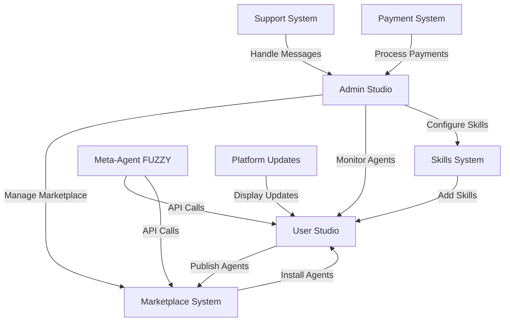
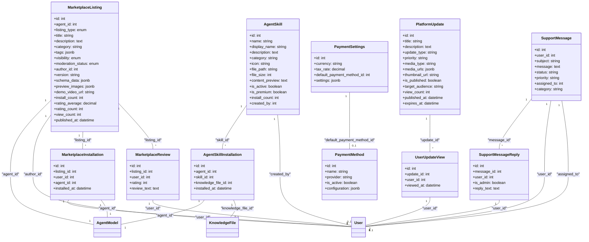
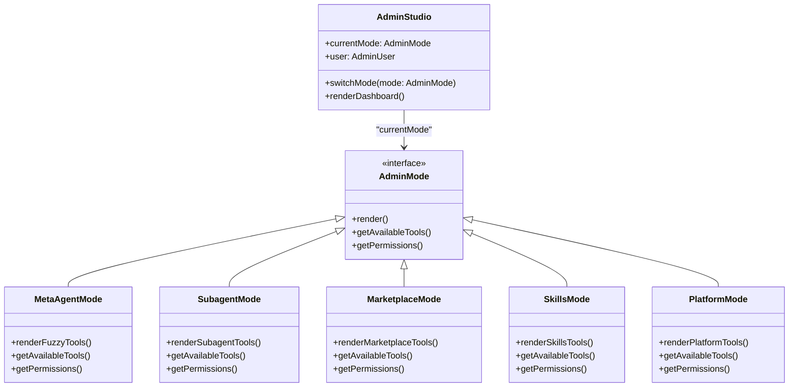
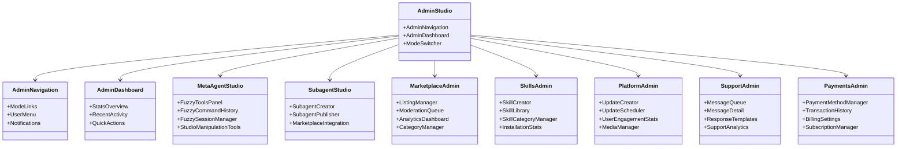
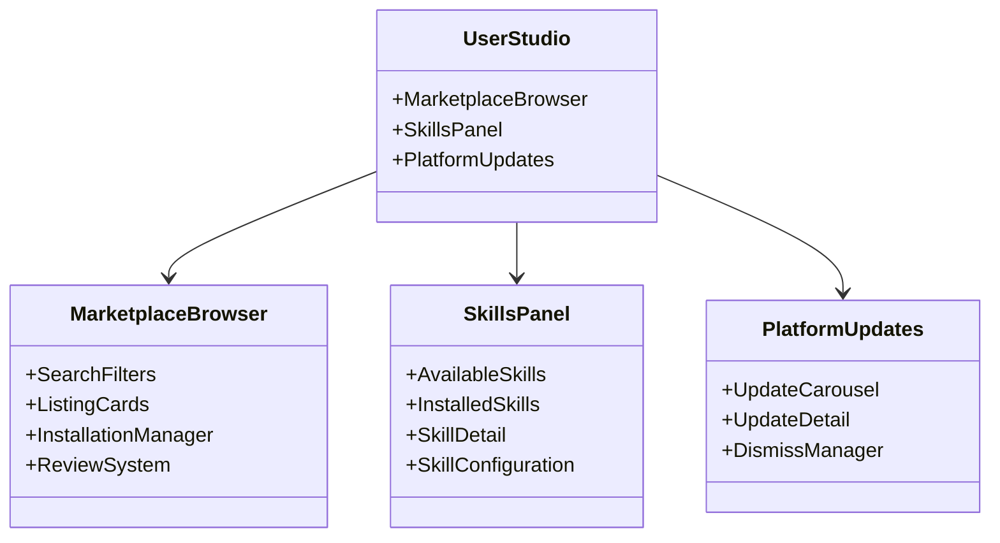
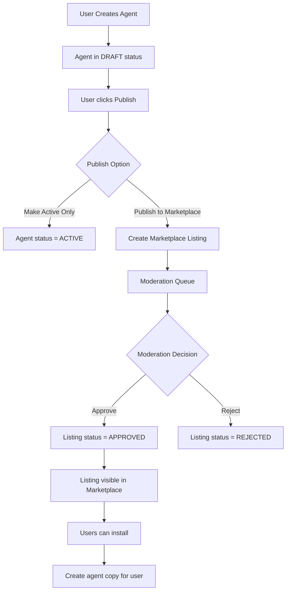
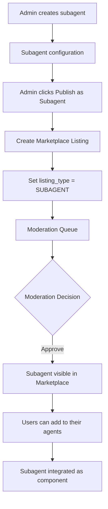
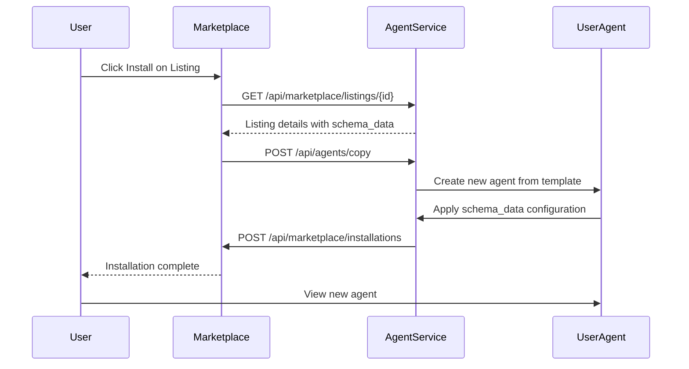
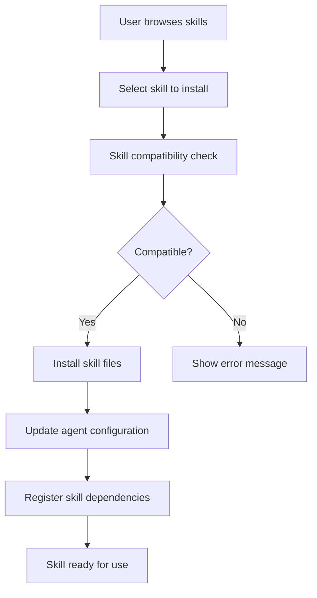

# Chronos AI Agent Builder Studio - Marketplace and Admin Studio Architecture

## Table of Contents

1. [System Overview](#system-overview)
2. [Database Schema Design](#database-schema-design)
3. [Admin Studio Architecture Decision](#admin-studio-architecture-decision)
4. [Meta-Agent Tools Specification](#meta-agent-tools-specification)
5. [API Endpoints Design](#api-endpoints-design)
6. [Frontend Component Structure](#frontend-component-structure)
7. [Publishing Workflows](#publishing-workflows)
8. [Skills System Design](#skills-system-design)
9. [Security Considerations](#security-considerations)
10. [Implementation Phases](#implementation-phases)

## System Overview



### High-Level Architecture

The expanded platform consists of several interconnected systems:

1. **Marketplace System**: Enables users to publish, discover, and install agents
2. **Admin Studio**: Unified interface for managing all platform aspects
3. **Meta-Agent FUZZY**: Specialized agent for studio manipulation and automation
4. **Skills System**: Reusable components that enhance agent capabilities
5. **Platform Updates**: Communication system for platform announcements
6. **Support System**: Customer support and messaging
7. **Payment System**: Payment method management

## Database Schema Design

### New Tables and Relationships



### Database Schema Notes

1. **Marketplace System**: Complete schema already exists in the codebase
2. **Skills System**: Complete schema already exists in the codebase
3. **Platform Updates**: Complete schema already exists in the codebase
4. **Support System**: Complete schema already exists in the codebase
5. **Payment System**: Complete schema already exists in the codebase

## Admin Studio Architecture Decision

### Recommendation: Unified Admin Studio with Mode Switching (Option B)

**Pros:**
- Consistent user experience across all admin functions
- Easier to maintain and update
- Better resource utilization
- Unified navigation and search
- Simpler permission management

**Cons:**
- More complex initial implementation
- Potential performance overhead from loading unused components
- Requires careful mode isolation

### Architecture Design



### Mode Switching Implementation

```typescript
// Frontend mode switching
type AdminMode = 'meta-agent' | 'subagent' | 'marketplace' | 'skills' | 'platform' | 'support' | 'payments'

interface AdminStudioProps {
    currentMode: AdminMode
    onModeChange: (mode: AdminMode) => void
    user: AdminUser
}

const AdminStudio: React.FC<AdminStudioProps> = ({ currentMode, onModeChange, user }) => {
    const renderModeContent = () => {
        switch (currentMode) {
            case 'meta-agent':
                return <MetaAgentStudio user={user} />
            case 'subagent':
                return <SubagentStudio user={user} />
            case 'marketplace':
                return <MarketplaceAdmin user={user} />
            case 'skills':
                return <SkillsAdmin user={user} />
            case 'platform':
                return <PlatformAdmin user={user} />
            case 'support':
                return <SupportAdmin user={user} />
            case 'payments':
                return <PaymentsAdmin user={user} />
        }
    }

    return (
        <div className="admin-studio">
            <AdminNavigation currentMode={currentMode} onModeChange={onModeChange} />
            <div className="admin-content">
                {renderModeContent()}
            </div>
        </div>
    )
}
```

## Meta-Agent Tools Specification

### FUZZY Tools for Studio Manipulation

Based on the existing meta-agent engine and the requirement to use API calls:

```typescript
interface FuzzyStudioTool {
    name: string
    description: string
    apiEndpoint: string
    requiredPermissions: string[]
    parameters: ToolParameter[]
}

const FUZZY_STUDIO_TOOLS: FuzzyStudioTool[] = [
    {
        name: 'create_agent_on_behalf',
        description: 'Create a new agent on behalf of a user',
        apiEndpoint: 'POST /api/admin/agents/create-on-behalf',
        requiredPermissions: ['admin', 'superuser'],
        parameters: [
            { name: 'user_id', type: 'integer', required: true },
            { name: 'agent_name', type: 'string', required: true },
            { name: 'agent_config', type: 'object', required: true }
        ]
    },
    {
        name: 'update_agent_config',
        description: 'Update agent configuration on behalf of a user',
        apiEndpoint: 'PUT /api/admin/agents/{agent_id}/config',
        requiredPermissions: ['admin', 'superuser'],
        parameters: [
            { name: 'agent_id', type: 'integer', required: true },
            { name: 'config_updates', type: 'object', required: true }
        ]
    },
    {
        name: 'publish_agent_to_marketplace',
        description: 'Publish a user agent to the marketplace',
        apiEndpoint: 'POST /api/admin/marketplace/publish',
        requiredPermissions: ['admin', 'superuser'],
        parameters: [
            { name: 'agent_id', type: 'integer', required: true },
            { name: 'listing_data', type: 'object', required: true }
        ]
    },
    {
        name: 'install_marketplace_agent',
        description: 'Install a marketplace agent for a user',
        apiEndpoint: 'POST /api/admin/marketplace/install',
        requiredPermissions: ['admin', 'superuser'],
        parameters: [
            { name: 'user_id', type: 'integer', required: true },
            { name: 'listing_id', type: 'integer', required: true }
        ]
    },
    {
        name: 'add_skill_to_agent',
        description: 'Add a skill to a user agent',
        apiEndpoint: 'POST /api/admin/skills/add-to-agent',
        requiredPermissions: ['admin', 'superuser'],
        parameters: [
            { name: 'agent_id', type: 'integer', required: true },
            { name: 'skill_id', type: 'integer', required: true }
        ]
    },
    {
        name: 'execute_agent_action',
        description: 'Execute an action on behalf of a user agent',
        apiEndpoint: 'POST /api/admin/agents/{agent_id}/execute',
        requiredPermissions: ['admin', 'superuser'],
        parameters: [
            { name: 'agent_id', type: 'integer', required: true },
            { name: 'action_name', type: 'string', required: true },
            { name: 'action_params', type: 'object', required: false }
        ]
    },
    {
        name: 'query_user_knowledge',
        description: 'Query knowledge base on behalf of a user',
        apiEndpoint: 'POST /api/admin/knowledge/query',
        requiredPermissions: ['admin', 'superuser'],
        parameters: [
            { name: 'user_id', type: 'integer', required: true },
            { name: 'query', type: 'string', required: true }
        ]
    },
    {
        name: 'manage_user_session',
        description: 'Manage user agent sessions',
        apiEndpoint: 'POST /api/admin/sessions/manage',
        requiredPermissions: ['admin', 'superuser'],
        parameters: [
            { name: 'user_id', type: 'integer', required: true },
            { name: 'session_action', type: 'string', required: true } // start, end, resume
        ]
    }
]
```

### FUZZY Integration with Existing Meta-Agent Engine

The FUZZY tools integrate with the existing `MetaAgentEngine` by:

1. **Intent Classification**: Extend `INTENT_PATTERNS` with studio manipulation patterns
2. **Action Planning**: Add studio-specific actions to `ACTION_TYPES`
3. **Permission Validation**: Ensure FUZZY has appropriate permissions
4. **API Execution**: Use existing HTTP client to call admin APIs

```python
# Extended intent patterns for FUZZY
FUZZY_INTENT_PATTERNS = {
    "create_agent_for_user": [
        r"create.*agent.*for.*user",
        r"build.*agent.*on.*behalf"
    ],
    "publish_to_marketplace": [
        r"publish.*to.*marketplace",
        r"list.*on.*marketplace"
    ],
    "install_marketplace_agent": [
        r"install.*marketplace.*agent",
        r"add.*marketplace.*listing"
    ],
    "manage_user_agent": [
        r"manage.*user.*agent",
        r"update.*agent.*for.*user"
    ]
}
```

## API Endpoints Design

### RESTful API Routes

#### Marketplace Endpoints

```http
POST /api/marketplace/listings
- Create a new marketplace listing
- Body: MarketplaceListingCreate schema
- Auth: Required (user)
- Returns: MarketplaceListingResponse

GET /api/marketplace/listings
- List marketplace listings with search/filter
- Query: MarketplaceSearchParams
- Auth: Optional (public listings)
- Returns: MarketplaceListingList

GET /api/marketplace/listings/{id}
- Get marketplace listing details
- Auth: Optional (public listings)
- Returns: MarketplaceListingResponse

POST /api/marketplace/listings/{id}/install
- Install a marketplace listing
- Auth: Required (user)
- Returns: MarketplaceInstallationResponse

POST /api/marketplace/listings/{id}/reviews
- Add a review to a marketplace listing
- Body: MarketplaceReviewCreate
- Auth: Required (user)
- Returns: MarketplaceReviewResponse

PUT /api/marketplace/listings/{id}
- Update marketplace listing (author/admin only)
- Body: MarketplaceListingUpdate
- Auth: Required (author/admin)
- Returns: MarketplaceListingResponse

POST /api/marketplace/listings/{id}/moderate
- Moderate marketplace listing (admin only)
- Body: ModerationAction
- Auth: Required (admin)
- Returns: MarketplaceListingResponse
```

#### Admin Studio Endpoints

```http
POST /api/admin/agents/create-on-behalf
- Create agent on behalf of user (FUZZY/admin)
- Body: { user_id: int, agent_data: AgentCreate }
- Auth: Required (admin)
- Returns: AgentResponse

PUT /api/admin/agents/{agent_id}/config
- Update agent configuration (FUZZY/admin)
- Body: { config_updates: object }
- Auth: Required (admin)
- Returns: AgentResponse

POST /api/admin/marketplace/publish
- Publish agent to marketplace (FUZZY/admin)
- Body: { agent_id: int, listing_data: MarketplaceListingCreate }
- Auth: Required (admin)
- Returns: MarketplaceListingResponse

POST /api/admin/marketplace/install
- Install marketplace agent for user (FUZZY/admin)
- Body: { user_id: int, listing_id: int }
- Auth: Required (admin)
- Returns: MarketplaceInstallationResponse

POST /api/admin/skills/add-to-agent
- Add skill to user agent (FUZZY/admin)
- Body: { agent_id: int, skill_id: int }
- Auth: Required (admin)
- Returns: AgentSkillInstallationResponse
```

#### Skills System Endpoints

```http
GET /api/skills
- List available skills
- Query: { category?: string, search?: string }
- Auth: Optional
- Returns: AgentSkillList

POST /api/skills
- Create new skill (admin only)
- Body: AgentSkillCreate
- Auth: Required (admin)
- Returns: AgentSkillResponse

POST /api/agents/{agent_id}/skills/{skill_id}
- Add skill to agent
- Auth: Required (user/admin)
- Returns: AgentSkillInstallationResponse

DELETE /api/agents/{agent_id}/skills/{skill_id}
- Remove skill from agent
- Auth: Required (user/admin)
- Returns: SuccessResponse

GET /api/agents/{agent_id}/skills
- List agent's installed skills
- Auth: Required (user/admin)
- Returns: AgentSkillInstallationList
```

#### Platform Updates Endpoints

```http
POST /api/admin/platform-updates
- Create platform update (admin only)
- Body: PlatformUpdateCreate
- Auth: Required (admin)
- Returns: PlatformUpdateResponse

GET /api/platform-updates
- Get platform updates for user
- Query: { limit?: int, offset?: int }
- Auth: Required (user)
- Returns: PlatformUpdateList

POST /api/platform-updates/{id}/view
- Mark platform update as viewed
- Auth: Required (user)
- Returns: SuccessResponse

PUT /api/admin/platform-updates/{id}
- Update platform update (admin only)
- Body: PlatformUpdateUpdate
- Auth: Required (admin)
- Returns: PlatformUpdateResponse
```

#### Support System Endpoints

```http
POST /api/support/messages
- Create support message
- Body: SupportMessageCreate
- Auth: Required (user)
- Returns: SupportMessageResponse

GET /api/support/messages
- List user's support messages
- Auth: Required (user)
- Returns: SupportMessageList

GET /api/admin/support/messages
- List all support messages (admin only)
- Query: { status?: string, priority?: string }
- Auth: Required (admin)
- Returns: SupportMessageList

POST /api/admin/support/messages/{id}/reply
- Reply to support message (admin only)
- Body: SupportMessageReplyCreate
- Auth: Required (admin)
- Returns: SupportMessageReplyResponse

PUT /api/admin/support/messages/{id}
- Update support message status (admin only)
- Body: SupportMessageUpdate
- Auth: Required (admin)
- Returns: SupportMessageResponse
```

#### Payment System Endpoints

```http
GET /api/admin/payment-methods
- List payment methods (admin only)
- Auth: Required (admin)
- Returns: PaymentMethodList

POST /api/admin/payment-methods
- Create payment method (admin only)
- Body: PaymentMethodCreate
- Auth: Required (admin)
- Returns: PaymentMethodResponse

PUT /api/admin/payment-methods/{id}
- Update payment method (admin only)
- Body: PaymentMethodUpdate
- Auth: Required (admin)
- Returns: PaymentMethodResponse

GET /api/admin/payment-settings
- Get payment settings (admin only)
- Auth: Required (admin)
- Returns: PaymentSettingsResponse

PUT /api/admin/payment-settings
- Update payment settings (admin only)
- Body: PaymentSettingsUpdate
- Auth: Required (admin)
- Returns: PaymentSettingsResponse
```

## Frontend Component Structure

### Admin Studio Component Hierarchy



### User Studio Component Enhancements



## Publishing Workflows

### Agent Publishing Flow



### Subagent Publishing Flow



### Agent Copying Mechanism



## Skills System Design

### Skills vs Tools Distinction

| Aspect | Skills | Tools |
|--------|--------|-------|
| **Purpose** | Pre-built capabilities | Custom functionality |
| **Creation** | Admin-created | User-created |
| **Storage** | File-based in backend/skills | Database-based |
| **Installation** | One-click from library | Manual configuration |
| **Customization** | Limited (parameters) | Full customization |
| **Sharing** | Marketplace distribution | Agent-specific |
| **Examples** | "Web Search", "Data Analysis" | "Custom API Call", "Web Scraper" |

### Skills Configuration Approach

```typescript
// Skill Definition File (JSON)
interface AgentSkillDefinition {
    name: string
    display_name: string
    description: string
    version: string
    category: string
    icon: string
    
    // Configuration schema
    config_schema: {
        properties: Record<string, {
            type: string
            description: string
            default?: any
            required?: boolean
        }>
    }
    
    // Execution configuration
    execution: {
        type: 'function' | 'workflow' | 'api'
        entry_point: string
        dependencies?: string[]
        timeout?: number
    }
    
    // UI configuration
    ui?: {
        settings_panel?: string
        quick_actions?: string[]
        documentation_url?: string
    }
}
```

### Skills File Structure

```
backend/skills/
├── analysis/
│   ├── web_search/
│   │   ├── skill.json          # Skill definition
│   │   ├── main.py             # Skill implementation
│   │   ├── requirements.txt    # Dependencies
│   │   ├── README.md           # Documentation
│   │   └── config_schema.json  # Configuration schema
│   └── data_analysis/
│       ├── skill.json
│       ├── analyzer.py
│       └── ...
├── automation/
│   ├── workflow_builder/
│   │   ├── skill.json
│   │   └── builder.py
│   └── ...
└── communication/
    ├── email_handler/
    │   ├── skill.json
    │   └── email.py
    └── ...
```

### Skills Installation Process



## Security Considerations

### Admin Access Control

```typescript
// Permission matrix
const ADMIN_PERMISSIONS = {
    'meta-agent': {
        required_role: 'admin',
        allowed_actions: [
            'create_agent_on_behalf',
            'update_agent_config',
            'execute_agent_action',
            'manage_user_session'
        ]
    },
    'subagent': {
        required_role: 'admin',
        allowed_actions: [
            'create_subagent',
            'publish_subagent',
            'manage_subagent_listings'
        ]
    },
    'marketplace': {
        required_role: 'moderator',
        allowed_actions: [
            'moderate_listings',
            'feature_listings',
            'manage_categories'
        ]
    },
    'skills': {
        required_role: 'admin',
        allowed_actions: [
            'create_skill',
            'update_skill',
            'publish_skill'
        ]
    },
    'platform': {
        required_role: 'admin',
        allowed_actions: [
            'create_update',
            'publish_update',
            'manage_media'
        ]
    },
    'support': {
        required_role: 'support',
        allowed_actions: [
            'view_messages',
            'reply_messages',
            'assign_messages'
        ]
    },
    'payments': {
        required_role: 'admin',
        allowed_actions: [
            'manage_payment_methods',
            'update_settings',
            'view_transactions'
        ]
    }
}
```

### Marketplace Safety Measures

1. **Content Moderation**: All listings require admin approval before publication
2. **Sandbox Execution**: Installed agents run in isolated environments
3. **Permission Scoping**: Marketplace agents have limited permissions by default
4. **Review System**: User reviews and ratings help identify problematic listings
5. **Version Control**: All marketplace installations are versioned for rollback
6. **Dependency Validation**: Skills and agents validate dependencies before installation
7. **Malware Scanning**: Uploaded files are scanned for malicious content

### API Security

```http
# Security headers for all admin endpoints
X-Content-Type-Options: nosniff
X-Frame-Options: DENY
Content-Security-Policy: default-src 'self'
Strict-Transport-Security: max-age=31536000; includeSubDomains

# Authentication requirements
- All admin endpoints require JWT with admin claims
- All user endpoints require JWT with user claims
- Sensitive operations require additional verification
```

## Implementation Phases

### Phase 1: Core Infrastructure

```markdown
[ ] Database schema implementation
[ ] API endpoint scaffolding
[ ] Authentication and authorization
[ ] Basic admin studio UI framework
[ ] Mode switching implementation
```

### Phase 2: Marketplace System

```markdown
[ ] Marketplace listing creation UI
[ ] Search and discovery functionality
[ ] Installation and copying mechanism
[ ] Review and rating system
[ ] Moderation workflow
```

### Phase 3: Admin Studio Modes

```markdown
[ ] Meta-Agent FUZZY tools implementation
[ ] Subagent creation and publishing
[ ] Marketplace management interface
[ ] Skills administration
[ ] Platform updates management
```

### Phase 4: Skills System

```markdown
[ ] Skills file structure and definitions
[ ] Skills discovery and browsing UI
[ ] Installation and configuration
[ ] Dependency management
[ ] Versioning and updates
```

### Phase 5: Platform Features

```markdown
[ ] Platform updates creation and display
[ ] Support messaging system
[ ] Payment method management
[ ] Analytics dashboard
[ ] User monitoring tools
```

### Phase 6: Integration and Testing

```markdown
[ ] End-to-end workflow testing
[ ] Security audit
[ ] Performance optimization
[ ] Documentation
[ ] User training materials
```

### Recommended Implementation Order

1. **Core Infrastructure** (Database, API, Auth)
2. **Marketplace System** (Highest user value)
3. **Admin Studio Framework** (Unified interface)
4. **Meta-Agent Tools** (FUZZY capabilities)
5. **Skills System** (Agent enhancement)
6. **Platform Features** (Updates, Support, Payments)
7. **Integration & Testing** (Quality assurance)

This phased approach ensures that the most valuable features are delivered first while maintaining a solid foundation for future expansion.
