# Phase 4 Sprint 37-40: Meta-Agent & Automation Features
## Comprehensive Architecture Document

---

## Document Information

- **Phase**: Phase 4 - Meta-Agent & Automation
- **Sprint Range**: 37-40
- **Document Version**: 1.0
- **Last Updated**: 2026-01-09
- **Status**: Draft - Pending Review

---

## 1. System Architecture Overview

### 1.1 High-Level System Architecture

The Phase 4 features extend the existing Chronos AI Agent Builder Studio with four major subsystems: Meta-Agent FUZZY, Automated Workflow Generation, Advanced Configuration Management, and System Optimization Module.

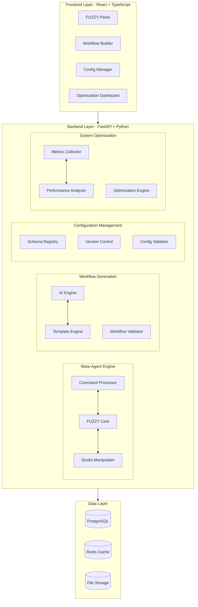

### 1.2 Component Interaction Diagram

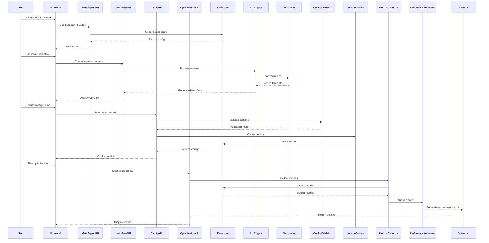

---

## 2. Meta-Agent FUZZY Design

### 2.1 FUZZY Core Architecture

The Meta-Agent FUZZY (Flexible Universal Zygotic Ystem) is a specialized agent with full studio manipulation capabilities. It serves as an orchestrator that can programmatically control all aspects of the agent builder studio.

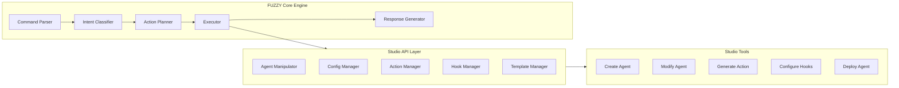

### 2.2 FUZZY Capabilities Matrix

| Capability | Description | Permission Level |
|------------|-------------|------------------|
| Agent Creation | Create new agents with custom configurations | Admin |
| Agent Modification | Modify existing agent configurations | Owner |
| Action Generation | Generate custom actions using AI | User+ |
| Hook Management | Configure pre/post/during operation hooks | User+ |
| Workflow Automation | Create and manage automated workflows | User+ |
| Configuration Management | Version control and schema management | Admin |
| System Optimization | Monitor and optimize system performance | Admin |
| Subagent Control | Manage subagent configurations | User+ |

### 2.3 FUZZY Data Models

#### Python Models (SQLAlchemy)

```python
# backend/app/models/meta_agent.py

from app.models.base import BaseModel, TimestampMixin
from sqlalchemy import Column, String, Boolean, JSON, ForeignKey, UUID, Text, Integer
from sqlalchemy.dialects.postgresql import UUID
import uuid


class MetaAgent(BaseModel, TimestampMixin):
    """
    Meta-Agent configuration for FUZZY capabilities.
    Each agent can optionally have a meta-agent enabled.
    """
    __tablename__ = "meta_agents"

    id = Column(UUID(as_uuid=True), primary_key=True, default=uuid.uuid4)
    agent_id = Column(UUID(as_uuid=True), ForeignKey("agents.id"), nullable=False, unique=True)
    is_enabled = Column(Boolean, default=False)
    fuzzy_enabled = Column(Boolean, default=False)
    
    # FUZZY Configuration
    capabilities = Column(JSON, default=list)
    permission_level = Column(String, default="user")  # user, admin, super_admin
    
    # Command settings
    auto_approve_commands = Column(Boolean, default=False)
    command_timeout_seconds = Column(Integer, default=300)
    max_concurrent_commands = Column(Integer, default=5)
    
    # Restrictions
    restricted_operations = Column(JSON, default=list)
    allowed_targets = Column(JSON, default=list)
    
    # Audit
    last_command_at = Column(DateTime)
    command_count = Column(Integer, default=0)
    error_count = Column(Integer, default=0)

    # Relationships
    agent = relationship("Agent", back_populates="meta_agent")
    command_history = relationship("MetaAgentCommand", back_populates="meta_agent")


class MetaAgentCommand(BaseModel, TimestampMixin):
    """
    Command history for meta-agent operations.
    """
    __tablename__ = "meta_agent_commands"

    id = Column(UUID(as_uuid=True), primary_key=True, default=uuid.uuid4)
    meta_agent_id = Column(UUID(as_uuid=True), ForeignKey("meta_agents.id"), nullable=False)
    
    # Command details
    command_type = Column(String, nullable=False)  # create_agent, modify_config, etc.
    command_payload = Column(JSON, nullable=False)
    command_status = Column(String, default="pending")  # pending, running, completed, failed
    
    # Execution details
    started_at = Column(DateTime)
    completed_at = Column(DateTime)
    execution_time_ms = Column(Integer)
    
    # Result
    result = Column(JSON)
    error_message = Column(Text)
    error_details = Column(JSON)
    
    # Audit
    executed_by = Column(String)  # user_id or system
    ip_address = Column(String)

    # Relationships
    meta_agent = relationship("MetaAgent", back_populates="command_history")
```

#### TypeScript Interfaces (Frontend)

```typescript
// frontend/src/types/meta-agent.ts

export interface MetaAgent {
  id: string;
  agentId: string;
  isEnabled: boolean;
  fuzzyEnabled: boolean;
  capabilities: MetaAgentCapability[];
  permissionLevel: 'user' | 'admin' | 'super_admin';
  autoApproveCommands: boolean;
  commandTimeoutSeconds: number;
  maxConcurrentCommands: number;
  restrictedOperations: string[];
  allowedTargets: string[];
  lastCommandAt: string;
  commandCount: number;
  errorCount: number;
  createdAt: string;
  updatedAt: string;
}

export interface MetaAgentCapability {
  name: string;
  description: string;
  enabled: boolean;
  parameters?: Record<string, unknown>;
}

export interface MetaAgentCommand {
  id: string;
  metaAgentId: string;
  commandType: MetaAgentCommandType;
  commandPayload: Record<string, unknown>;
  commandStatus: MetaAgentCommandStatus;
  startedAt: string;
  completedAt: string;
  executionTimeMs: number;
  result?: Record<string, unknown>;
  errorMessage?: string;
  errorDetails?: Record<string, unknown>;
  executedBy: string;
  ipAddress: string;
}

export type MetaAgentCommandType = 
  | 'create_agent'
  | 'modify_agent'
  | 'delete_agent'
  | 'generate_action'
  | 'configure_hook'
  | 'deploy_agent'
  | 'create_workflow'
  | 'update_config'
  | 'run_optimization';

export type MetaAgentCommandStatus = 
  | 'pending'
  | 'running'
  | 'completed'
  | 'failed'
  | 'cancelled';
```

### 2.4 Pydantic Schemas

```python
# backend/app/schemas/meta_agent.py

from pydantic import BaseModel, Field
from typing import Optional, List, Dict, Any
from datetime import datetime
from enum import Enum


class MetaAgentCapability(BaseModel):
    name: str
    description: str
    enabled: bool = True
    parameters: Optional[Dict[str, Any]] = None


class MetaAgentCreate(BaseModel):
    agent_id: str
    fuzzy_enabled: bool = False
    capabilities: List[MetaAgentCapability] = []
    permission_level: str = "user"
    auto_approve_commands: bool = False
    command_timeout_seconds: int = 300
    max_concurrent_commands: int = 5
    restricted_operations: List[str] = []
    allowed_targets: List[str] = []


class MetaAgentUpdate(BaseModel):
    fuzzy_enabled: Optional[bool] = None
    capabilities: Optional[List[MetaAgentCapability]] = None
    permission_level: Optional[str] = None
    auto_approve_commands: Optional[bool] = None
    command_timeout_seconds: Optional[int] = None
    max_concurrent_commands: Optional[int] = None
    restricted_operations: Optional[List[str]] = None
    allowed_targets: Optional[List[str]] = None


class MetaAgentResponse(BaseModel):
    id: str
    agent_id: str
    is_enabled: bool
    fuzzy_enabled: bool
    capabilities: List[MetaAgentCapability]
    permission_level: str
    auto_approve_commands: bool
    command_timeout_seconds: int
    max_concurrent_commands: int
    restricted_operations: List[str]
    allowed_targets: List[str]
    last_command_at: Optional[datetime]
    command_count: int
    error_count: int
    created_at: datetime
    updated_at: datetime


class MetaAgentCommandCreate(BaseModel):
    command_type: str
    command_payload: Dict[str, Any]
    execute_immediately: bool = False


class MetaAgentCommandResponse(BaseModel):
    id: str
    meta_agent_id: str
    command_type: str
    command_payload: Dict[str, Any]
    command_status: str
    started_at: Optional[datetime]
    completed_at: Optional[datetime]
    execution_time_ms: Optional[int]
    result: Optional[Dict[str, Any]]
    error_message: Optional[str]
    executed_by: str
```

---

## 3. Automated Workflow Generation System

### 3.1 Architecture Overview

The Automated Workflow Generation System enables users to create intelligent workflows using AI-powered automation. The system combines template-based generation with AI-driven adaptation.

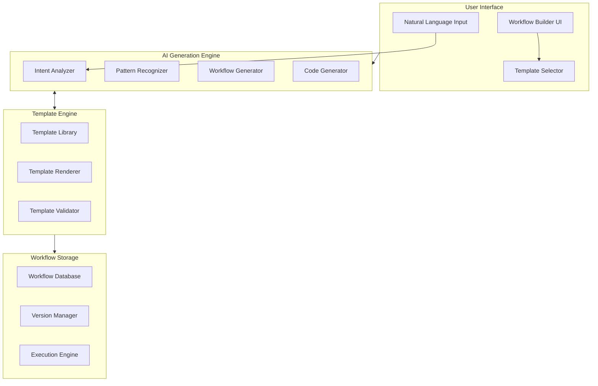

### 3.2 Workflow Generation Pipeline

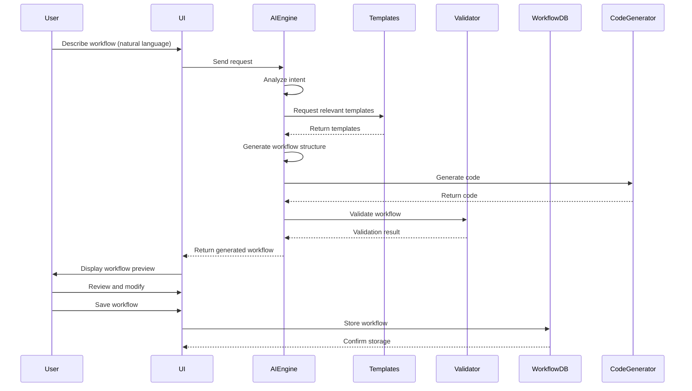

### 3.3 Data Models

#### Python Models

```python
# backend/app/models/workflow_generation.py

from app.models.base import BaseModel, TimestampMixin
from sqlalchemy import Column, String, Boolean, JSON, ForeignKey, UUID, Text, Integer
from sqlalchemy.dialects.postgresql import UUID
import uuid


class WorkflowTemplate(BaseModel, TimestampMixin):
    """
    Pre-built workflow templates for common automation patterns.
    """
    __tablename__ = "workflow_templates"

    id = Column(UUID(as_uuid=True), primary_key=True, default=uuid.uuid4)
    name = Column(String, nullable=False)
    description = Column(Text)
    category = Column(String, nullable=False)  # automation, integration, processing
    version = Column(String, default="1.0.0")
    
    # Template content
    template_schema = Column(JSON, nullable=False)
    template_code = Column(Text)
    parameters = Column(JSON, default=list)
    
    # Metadata
    is_public = Column(Boolean, default=False)
    is_ai_generated = Column(Boolean, default=False)
    usage_count = Column(Integer, default=0)
    
    # Requirements
    required_capabilities = Column(JSON, default=list)
    required_integrations = Column(JSON, default=list)


class GeneratedWorkflow(BaseModel, TimestampMixin):
    """
    User-generated or AI-generated workflows.
    """
    __tablename__ = "generated_workflows"

    id = Column(UUID(as_uuid=True), primary_key=True, default=uuid.uuid4)
    name = Column(String, nullable=False)
    description = Column(Text)
    agent_id = Column(UUID(as_uuid=True), ForeignKey("agents.id"), nullable=False)
    
    # Workflow definition
    workflow_type = Column(String, default="custom")  # custom, ai_generated, template_based
    template_id = Column(UUID(as_uuid=True), ForeignKey("workflow_templates.id"))
    
    # Content
    nodes = Column(JSON, nullable=False)  # Workflow node definitions
    edges = Column(JSON, nullable=False)  # Workflow edge definitions
    configuration = Column(JSON, default=dict)
    
    # Status
    is_active = Column(Boolean, default=True)
    is_validated = Column(Boolean, default=False)
    last_executed_at = Column(DateTime)
    execution_count = Column(Integer, default=0)
    
    # AI generation metadata
    generation_prompt = Column(Text)
    generation_model = Column(String)
    generation_confidence = Column(Float)

    # Relationships
    agent = relationship("Agent", back_populates="workflows")
    template = relationship("WorkflowTemplate", back_populates="workflows")
    executions = relationship("WorkflowExecution", back_populates="workflow")


class WorkflowExecution(BaseModel, TimestampMixin):
    """
    Execution records for workflows.
    """
    __tablename__ = "workflow_executions"

    id = Column(UUID(as_uuid=True), primary_key=True, default=uuid.uuid4)
    workflow_id = Column(UUID(as_uuid=True), ForeignKey("generated_workflows.id"), nullable=False)
    
    # Execution details
    execution_status = Column(String, default="pending")  # pending, running, completed, failed
    started_at = Column(DateTime)
    completed_at = Column(DateTime)
    execution_time_ms = Column(Integer)
    
    # Input/Output
    input_data = Column(JSON)
    output_data = Column(JSON)
    
    # Error handling
    error_message = Column(Text)
    error_node = Column(String)
    retry_count = Column(Integer, default=0)
    
    # Audit
    triggered_by = Column(String)  # user, schedule, webhook, api

    # Relationships
    workflow = relationship("GeneratedWorkflow", back_populates="executions")
```

#### TypeScript Interfaces

```typescript
// frontend/src/types/workflow.ts

export interface WorkflowTemplate {
  id: string;
  name: string;
  description: string;
  category: WorkflowCategory;
  version: string;
  templateSchema: WorkflowNode[];
  templateCode?: string;
  parameters: WorkflowParameter[];
  isPublic: boolean;
  isAiGenerated: boolean;
  usageCount: number;
  requiredCapabilities: string[];
  requiredIntegrations: string[];
  createdAt: string;
  updatedAt: string;
}

export interface GeneratedWorkflow {
  id: string;
  name: string;
  description: string;
  agentId: string;
  workflowType: 'custom' | 'ai_generated' | 'template_based';
  templateId?: string;
  nodes: WorkflowNode[];
  edges: WorkflowEdge[];
  configuration: WorkflowConfiguration;
  isActive: boolean;
  isValidated: boolean;
  lastExecutedAt?: string;
  executionCount: number;
  generationPrompt?: string;
  generationModel?: string;
  generationConfidence?: number;
  createdAt: string;
  updatedAt: string;
}

export interface WorkflowNode {
  id: string;
  type: WorkflowNodeType;
  position: { x: number; y: number };
  data: Record<string, unknown>;
}

export type WorkflowNodeType = 
  | 'trigger'
  | 'action'
  | 'condition'
  | 'loop'
  | 'api_call'
  | 'data_transform'
  | 'notification'
  | 'integration';

export interface WorkflowEdge {
  id: string;
  source: string;
  target: string;
  sourceHandle?: string;
  targetHandle?: string;
  label?: string;
}

export interface WorkflowConfiguration {
  triggerType: 'manual' | 'schedule' | 'webhook' | 'event';
  schedule?: string;
  webhookPath?: string;
  retryPolicy?: RetryPolicy;
  timeoutSeconds?: number;
}

export interface RetryPolicy {
  maxRetries: number;
  retryDelayMs: number;
  backoffMultiplier: number;
}

export type WorkflowCategory = 
  | 'automation'
  | 'integration'
  | 'processing'
  | 'notification'
  | 'data_handling';
```

---

## 4. Advanced Configuration Management

### 4.1 Architecture Overview

The Advanced Configuration Management system provides comprehensive versioning, schema validation, and configuration governance for all agent configurations.

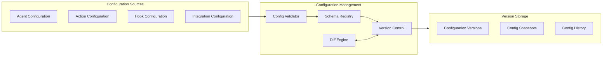

### 4.2 Configuration Schema Design

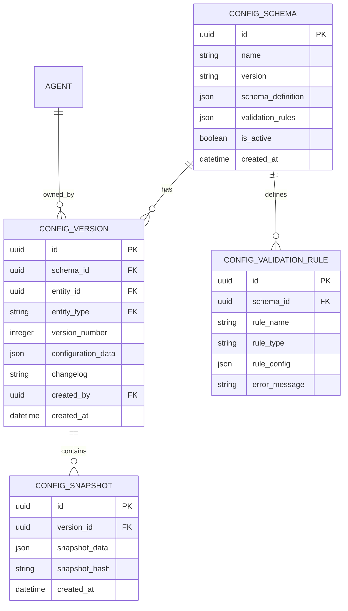

### 4.3 Data Models

```python
# backend/app/models/configuration_versions.py

from app.models.base import BaseModel, TimestampMixin
from sqlalchemy import Column, String, Boolean, JSON, ForeignKey, UUID, Text, Integer
from sqlalchemy.dialects.postgresql import UUID
import uuid


class ConfigSchema(BaseModel, TimestampMixin):
    """
    Schema registry for configuration validation.
    """
    __tablename__ = "config_schemas"

    id = Column(UUID(as_uuid=True), primary_key=True, default=uuid.uuid4)
    name = Column(String, nullable=False)  # agent_config, action_config, etc.
    version = Column(String, nullable=False)  # Semantic versioning
    schema_definition = Column(JSON, nullable=False)  # JSON Schema
    validation_rules = Column(JSON, default=dict)
    
    # Schema metadata
    description = Column(Text)
    is_active = Column(Boolean, default=True)
    is_strict = Column(Boolean, default=True)  # Fail on validation errors
    
    # Compatibility
    previous_version_id = Column(UUID(as_uuid=True), ForeignKey("config_schemas.id"))
    migration_script = Column(Text)


class ConfigVersion(BaseModel, TimestampMixin):
    """
    Versioned configuration storage with full history.
    """
    __tablename__ = "config_versions"

    id = Column(UUID(as_uuid=True), primary_key=True, default=uuid.uuid4)
    schema_id = Column(UUID(as_uuid=True), ForeignKey("config_schemas.id"), nullable=False)
    
    # Entity reference
    entity_type = Column(String, nullable=False)  # agent, action, hook, integration
    entity_id = Column(UUID(as_uuid=True), nullable=False)
    
    # Version information
    version_number = Column(Integer, nullable=False)
    is_latest = Column(Boolean, default=True)
    is_major_version = Column(Boolean, default=False)
    
    # Configuration data
    configuration_data = Column(JSON, nullable=False)
    configuration_hash = Column(String)  # SHA-256 hash for integrity
    
    # Change tracking
    changelog = Column(Text)
    change_summary = Column(JSON)  # Diff summary
    created_by = Column(UUID(as_uuid=True), ForeignKey("users.id"))
    
    # Relationships
    schema = relationship("ConfigSchema")
    snapshots = relationship("ConfigSnapshot", back_populates="version")


class ConfigSnapshot(BaseModel, TimestampMixin):
    """
    Point-in-time snapshots of configurations for rollback and audit.
    """
    __tablename__ = "config_snapshots"

    id = Column(UUID(as_uuid=True), primary_key=True, default=uuid.uuid4)
    version_id = Column(UUID(as_uuid=True), ForeignKey("config_versions.id"), nullable=False)
    
    snapshot_data = Column(JSON, nullable=False)
    snapshot_hash = Column(String, nullable=False)  # SHA-256 hash
    
    # Snapshot metadata
    snapshot_type = Column(String, default="full")  # full, incremental
    size_bytes = Column(Integer)
    compression_type = Column(String)  # None, gzip, lz4

    # Relationships
    version = relationship("ConfigVersion", back_populates="snapshots")


class ConfigValidationRule(BaseModel, TimestampMixin):
    """
    Custom validation rules for configurations.
    """
    __tablename__ = "config_validation_rules"

    id = Column(UUID(as_uuid=True), primary_key=True, default=uuid.uuid4)
    schema_id = Column(UUID(as_uuid=True), ForeignKey("config_schemas.id"), nullable=False)
    
    rule_name = Column(String, nullable=False)
    rule_type = Column(String, nullable=False)  # required, pattern, range, custom
    rule_config = Column(JSON, nullable=False)
    error_message = Column(Text)
    severity = Column(String, default="error")  # error, warning, info
    is_active = Column(Boolean, default=True)

    # Relationships
    schema = relationship("ConfigSchema")
```

### 4.4 Configuration Validation Flow

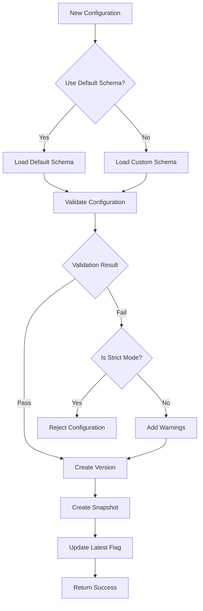

---

## 5. System Optimization Module

### 5.1 Architecture Overview

The System Optimization Module provides comprehensive monitoring, metrics collection, and automated optimization recommendations for the agent builder platform.

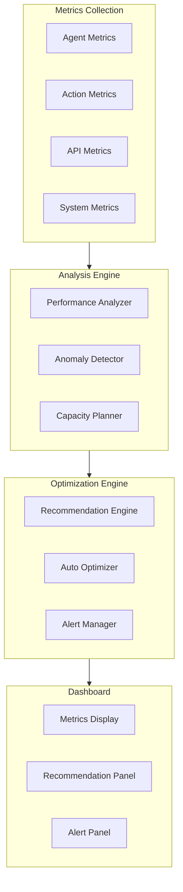

### 5.2 Data Models

```python
# backend/app/models/system_metrics.py

from app.models.base import BaseModel, TimestampMixin
from sqlalchemy import Column, String, Boolean, JSON, ForeignKey, UUID, Float, Integer, DateTime
from sqlalchemy.dialects.postgresql import UUID
from sqlalchemy.sql import func
import uuid


class SystemMetrics(BaseModel, TimestampMixin):
    """
    System-wide performance and usage metrics.
    """
    __tablename__ = "system_metrics"

    id = Column(UUID(as_uuid=True), primary_key=True, default=uuid.uuid4)
    
    # Time series data
    timestamp = Column(DateTime(timezone=True), server_default=func.now(), nullable=False)
    metric_type = Column(String, nullable=False)  # performance, usage, health
    
    # Metric name and value
    metric_name = Column(String, nullable=False)
    metric_value = Column(Float, nullable=False)
    metric_unit = Column(String)
    
    # Dimensions
    agent_id = Column(UUID(as_uuid=True))
    component = Column(String)  # api, database, cache, agent
    operation = Column(String)
    
    # Metadata
    metadata = Column(JSON, default=dict)


class AgentPerformanceMetrics(BaseModel, TimestampMixin):
    """
    Per-agent performance metrics.
    """
    __tablename__ = "agent_performance_metrics"

    id = Column(UUID(as_uuid=True), primary_key=True, default=uuid.uuid4)
    agent_id = Column(UUID(as_uuid=True), ForeignKey("agents.id"), nullable=False)
    
    timestamp = Column(DateTime(timezone=True), server_default=func.now(), nullable=False)
    
    # Performance metrics
    response_time_ms = Column(Float)
    throughput = Column(Float)  # requests per second
    error_rate = Column(Float)
    success_rate = Column(Float)
    
    # Resource metrics
    memory_usage_mb = Column(Float)
    cpu_usage_percent = Column(Float)
    token_usage = Column(Integer)
    
    # AI model metrics
    llm_calls = Column(Integer)
    llm_total_tokens = Column(Integer)
    llm_input_tokens = Column(Integer)
    llm_output_tokens = Column(Integer)
    llm_cost_usd = Column(Float)

    # Relationships
    agent = relationship("Agent")


class OptimizationRecommendation(BaseModel, TimestampMixin):
    """
    Automated optimization recommendations.
    """
    __tablename__ = "optimization_recommendations"

    id = Column(UUID(as_uuid=True), primary_key=True, default=uuid.uuid4)
    agent_id = Column(UUID(as_uuid=True), ForeignKey("agents.id"))
    
    # Recommendation details
    recommendation_type = Column(String, nullable=False)  # performance, cost, reliability
    category = Column(String, nullable=False)  # prompt, model, configuration, integration
    title = Column(String, nullable=False)
    description = Column(Text)
    
    # Impact analysis
    current_impact = Column(JSON)  # current performance/cost
    expected_impact = Column(JSON)  # expected improvement
    confidence_score = Column(Float)
    
    # Implementation
    implementation_effort = Column(String)  # low, medium, high
    implementation_steps = Column(JSON, default=list)
    code_changes = Column(JSON, default=list)
    configuration_changes = Column(JSON, default=list)
    
    # Status
    status = Column(String, default="pending")  # pending, reviewed, implemented, dismissed
    reviewed_by = Column(UUID(as_uuid=True), ForeignKey("users.id"))
    reviewed_at = Column(DateTime)
    implemented_at = Column(DateTime)


class OptimizationAlert(BaseModel, TimestampMixin):
    """
    System alerts for optimization opportunities and issues.
    """
    __tablename__ = "optimization_alerts"

    id = Column(UUID(as_uuid=True), primary_key=True, default=uuid.uuid4)
    
    alert_type = Column(String, nullable=False)  # performance_degradation, high_cost, error_spike
    severity = Column(String, nullable=False)  # critical, warning, info
    
    # Alert details
    title = Column(String, nullable=False)
    message = Column(Text)
    affected_components = Column(JSON, default=list)
    
    # Threshold data
    threshold_value = Column(Float)
    current_value = Column(Float)
    
    # Resolution
    suggested_actions = Column(JSON, default=list)
    is_resolved = Column(Boolean, default=False)
    resolved_at = Column(DateTime)
    resolved_by = Column(UUID(as_uuid=True), ForeignKey("users.id"))
    resolution_notes = Column(Text)
```

### 5.3 Metrics Collection Pipeline

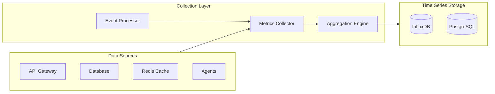

---

## 6. API Specifications

### 6.1 Meta-Agent API Endpoints

```
# Base URL: /api/v1/meta-agent

# Meta-Agent Configuration
POST   /meta-agents                          # Create meta-agent config
GET    /meta-agents/{id}                     # Get meta-agent config
PUT    /meta-agents/{id}                     # Update meta-agent config
DELETE /meta-agents/{id}                     # Delete meta-agent config

# Agent Association
POST   /agents/{agent_id}/meta-agent         # Enable meta-agent for agent
GET    /agents/{agent_id}/meta-agent         # Get agent's meta-agent status
DELETE /agents/{agent_id}/meta-agent         # Disable meta-agent

# Command Execution
POST   /meta-agents/{id}/commands            # Execute meta-agent command
GET    /meta-agents/{id}/commands            # List command history
GET    /meta-agents/{id}/commands/{cmd_id}   # Get command details
DELETE /meta-agents/{id}/commands/{cmd_id}   # Cancel pending command

# Capability Management
GET    /meta-agents/{id}/capabilities        # List capabilities
PUT    /meta-agents/{id}/capabilities        # Update capabilities
```

### 6.2 Workflow Generation API Endpoints

```
# Base URL: /api/v1/workflows

# Template Management
GET    /workflows/templates                  # List available templates
GET    /workflows/templates/{id}             # Get template details
POST   /workflows/templates                  # Create custom template
PUT    /workflows/templates/{id}             # Update template
DELETE /workflows/templates/{id}             # Delete template

# Workflow Management
GET    /agents/{agent_id}/workflows          # List agent workflows
POST   /agents/{agent_id}/workflows          # Create new workflow
GET    /agents/{agent_id}/workflows/{id}     # Get workflow details
PUT    /agents/{agent_id}/workflows/{id}     # Update workflow
DELETE /agents/{agent_id}/workflows/{id}     # Delete workflow

# AI Generation
POST   /workflows/generate                   # Generate workflow via AI
POST   /workflows/generate-from-template     # Generate from template
POST   /workflows/validate                   # Validate workflow schema

# Execution
POST   /workflows/{id}/execute               # Execute workflow
POST   /workflows/{id}/schedule              # Schedule workflow
DELETE /workflows/{id}/schedule              # Cancel scheduled execution
GET    /workflows/{id}/executions            # List executions
GET    /workflows/{id}/executions/{exec_id}  # Get execution details
```

### 6.3 Configuration Management API Endpoints

```
# Base URL: /api/v1/config

# Schema Management
GET    /config/schemas                       # List config schemas
POST   /config/schemas                       # Create new schema
GET    /config/schemas/{id}                  # Get schema details
PUT    /config/schemas/{id}                  # Update schema
DELETE /config/schemas/{id}                  # Delete schema
POST   /config/schemas/{id}/validate         # Validate against schema

# Version Management
GET    /config/entities/{type}/{id}/versions # List entity versions
GET    /config/entities/{type}/{id}/versions/{ver} # Get specific version
POST   /config/entities/{type}/{id}/versions # Create new version
POST   /config/entities/{type}/{id}/rollback # Rollback to version
GET    /config/entities/{type}/{id}/diff     # Compare versions

# Snapshot Management
GET    /config/versions/{id}/snapshots       # List version snapshots
POST   /config/versions/{id}/snapshots       # Create snapshot
GET    /config/versions/{id}/snapshots/{sid} # Get snapshot
POST   /config/versions/{id}/restore         # Restore from snapshot
```

### 6.4 System Optimization API Endpoints

```
# Base URL: /api/v1/optimization

# Metrics
GET    /optimization/metrics                 # Get system metrics
GET    /optimization/metrics/agent/{id}      # Get agent metrics
GET    /optimization/metrics/summary         # Get metrics summary
POST   /optimization/metrics/query           # Custom metrics query

# Recommendations
GET    /optimization/recommendations         # List recommendations
GET    /optimization/recommendations/{id}    # Get recommendation details
POST   /optimization/recommendations/{id}/review # Mark as reviewed
POST   /optimization/recommendations/{id}/implement # Mark as implemented
POST   /optimization/recommendations/{id}/dismiss  # Dismiss recommendation

# Alerts
GET    /optimization/alerts                  # List active alerts
GET    /optimization/alerts/{id}             # Get alert details
POST   /optimization/alerts/{id}/resolve     # Resolve alert
POST   /optimization/alerts/{id}/acknowledge # Acknowledge alert

# Analysis
POST   /optimization/analyze/agent/{id}      # Analyze agent performance
POST   /optimization/analyze/system          # Analyze system performance
GET    /optimization/trends                  # Get performance trends
```

### 6.5 Request/Response Examples

#### Meta-Agent Command Execution

```json
// Request: POST /api/v1/meta-agents/{id}/commands
{
  "command_type": "create_agent",
  "command_payload": {
    "name": "New Agent",
    "description": "Created via FUZZY",
    "configuration": {
      "system_instructions": "You are a helpful assistant.",
      "model": "gpt-4"
    }
  },
  "execute_immediately": true
}

// Response: 202 Accepted
{
  "id": "cmd-uuid-1234",
  "meta_agent_id": "ma-uuid-5678",
  "command_type": "create_agent",
  "command_payload": {...},
  "command_status": "running",
  "started_at": "2026-01-09T12:00:00Z",
  "result": null,
  "executed_by": "user-uuid-9012"
}
```

#### Workflow Generation Request

```json
// Request: POST /api/v1/workflows/generate
{
  "description": "Create a workflow that monitors my email and creates tasks for important emails",
  "agent_id": "agent-uuid-1234",
  "preferences": {
    "complexity": "intermediate",
    "include_ai_processing": true,
    "notification_channel": "slack"
  }
}

// Response: 201 Created
{
  "id": "workflow-uuid-5678",
  "name": "Email Task Automation",
  "description": "Monitor email and create tasks for important messages",
  "workflow_type": "ai_generated",
  "nodes": [...],
  "edges": [...],
  "generation_confidence": 0.87,
  "is_validated": true,
  "created_at": "2026-01-09T12:00:00Z"
}
```

---

## 7. Database Schema Changes

### 7.1 New Tables Summary

| Table Name | Purpose | Primary Key |
|------------|---------|-------------|
| `meta_agents` | Meta-Agent configurations | `id` (UUID) |
| `meta_agent_commands` | Command execution history | `id` (UUID) |
| `workflow_templates` | Workflow template library | `id` (UUID) |
| `generated_workflows` | User/AI generated workflows | `id` (UUID) |
| `workflow_executions` | Workflow execution records | `id` (UUID) |
| `config_schemas` | Configuration schema registry | `id` (UUID) |
| `config_versions` | Configuration version history | `id` (UUID) |
| `config_snapshots` | Configuration snapshots | `id` (UUID) |
| `config_validation_rules` | Custom validation rules | `id` (UUID) |
| `system_metrics` | System-wide metrics | `id` (UUID) |
| `agent_performance_metrics` | Per-agent performance | `id` (UUID) |
| `optimization_recommendations` | Optimization recommendations | `id` (UUID) |
| `optimization_alerts` | System alerts | `id` (UUID) |

### 7.2 Table Creation Scripts

```sql
-- Meta-Agents Table
CREATE TABLE IF NOT EXISTS meta_agents (
    id UUID PRIMARY KEY DEFAULT gen_random_uuid(),
    agent_id UUID NOT NULL UNIQUE REFERENCES agents(id),
    is_enabled BOOLEAN DEFAULT FALSE,
    fuzzy_enabled BOOLEAN DEFAULT FALSE,
    capabilities JSONB DEFAULT '[]'::jsonb,
    permission_level VARCHAR DEFAULT 'user',
    auto_approve_commands BOOLEAN DEFAULT FALSE,
    command_timeout_seconds INTEGER DEFAULT 300,
    max_concurrent_commands INTEGER DEFAULT 5,
    restricted_operations JSONB DEFAULT '[]'::jsonb,
    allowed_targets JSONB DEFAULT '[]'::jsonb,
    last_command_at TIMESTAMP,
    command_count INTEGER DEFAULT 0,
    error_count INTEGER DEFAULT 0,
    created_at TIMESTAMP DEFAULT NOW(),
    updated_at TIMESTAMP DEFAULT NOW()
);

-- Meta-Agent Commands Table
CREATE TABLE IF NOT EXISTS meta_agent_commands (
    id UUID PRIMARY KEY DEFAULT gen_random_uuid(),
    meta_agent_id UUID NOT NULL REFERENCES meta_agents(id),
    command_type VARCHAR NOT NULL,
    command_payload JSONB NOT NULL,
    command_status VARCHAR DEFAULT 'pending',
    started_at TIMESTAMP,
    completed_at TIMESTAMP,
    execution_time_ms INTEGER,
    result JSONB,
    error_message TEXT,
    error_details JSONB,
    executed_by VARCHAR,
    ip_address VARCHAR,
    created_at TIMESTAMP DEFAULT NOW()
);

-- Workflow Templates Table
CREATE TABLE IF NOT EXISTS workflow_templates (
    id UUID PRIMARY KEY DEFAULT gen_random_uuid(),
    name VARCHAR NOT NULL,
    description TEXT,
    category VARCHAR NOT NULL,
    version VARCHAR DEFAULT '1.0.0',
    template_schema JSONB NOT NULL,
    template_code TEXT,
    parameters JSONB DEFAULT '[]'::jsonb,
    is_public BOOLEAN DEFAULT FALSE,
    is_ai_generated BOOLEAN DEFAULT FALSE,
    usage_count INTEGER DEFAULT 0,
    required_capabilities JSONB DEFAULT '[]'::jsonb,
    required_integrations JSONB DEFAULT '[]'::jsonb,
    created_at TIMESTAMP DEFAULT NOW(),
    updated_at TIMESTAMP DEFAULT NOW()
);

-- Generated Workflows Table
CREATE TABLE IF NOT EXISTS generated_workflows (
    id UUID PRIMARY KEY DEFAULT gen_random_uuid(),
    name VARCHAR NOT NULL,
    description TEXT,
    agent_id UUID NOT NULL REFERENCES agents(id),
    workflow_type VARCHAR DEFAULT 'custom',
    template_id UUID REFERENCES workflow_templates(id),
    nodes JSONB NOT NULL,
    edges JSONB NOT NULL,
    configuration JSONB DEFAULT '{}'::jsonb,
    is_active BOOLEAN DEFAULT TRUE,
    is_validated BOOLEAN DEFAULT FALSE,
    last_executed_at TIMESTAMP,
    execution_count INTEGER DEFAULT 0,
    generation_prompt TEXT,
    generation_model VARCHAR,
    generation_confidence FLOAT,
    created_at TIMESTAMP DEFAULT NOW(),
    updated_at TIMESTAMP DEFAULT NOW()
);

-- Config Schemas Table
CREATE TABLE IF NOT EXISTS config_schemas (
    id UUID PRIMARY KEY DEFAULT gen_random_uuid(),
    name VARCHAR NOT NULL,
    version VARCHAR NOT NULL,
    schema_definition JSONB NOT NULL,
    validation_rules JSONB DEFAULT '{}'::jsonb,
    description TEXT,
    is_active BOOLEAN DEFAULT TRUE,
    is_strict BOOLEAN previous_version_id UUID DEFAULT TRUE,
    REFERENCES config_schemas(id),
    migration_script TEXT,
    created_at TIMESTAMP DEFAULT NOW(),
    updated_at TIMESTAMP DEFAULT NOW()
);

-- Config Versions Table
CREATE TABLE IF NOT EXISTS config_versions (
    id UUID PRIMARY KEY DEFAULT gen_random_uuid(),
    schema_id UUID NOT NULL REFERENCES config_schemas(id),
    entity_type VARCHAR NOT NULL,
    entity_id UUID NOT NULL,
    version_number INTEGER NOT NULL,
    is_latest BOOLEAN DEFAULT TRUE,
    is_major_version BOOLEAN DEFAULT FALSE,
    configuration_data JSONB NOT NULL,
    configuration_hash VARCHAR,
    changelog TEXT,
    change_summary JSONB,
    created_by UUID REFERENCES users(id),
    created_at TIMESTAMP DEFAULT NOW()
);

-- System Metrics Table
CREATE TABLE IF NOT EXISTS system_metrics (
    id UUID PRIMARY KEY DEFAULT gen_random_uuid(),
    timestamp TIMESTAMP NOT NULL DEFAULT NOW(),
    metric_type VARCHAR NOT NULL,
    metric_name VARCHAR NOT NULL,
    metric_value FLOAT NOT NULL,
    metric_unit VARCHAR,
    agent_id UUID,
    component VARCHAR,
    operation VARCHAR,
    metadata JSONB DEFAULT '{}'::jsonb
);

-- Optimization Recommendations Table
CREATE TABLE IF NOT EXISTS optimization_recommendations (
    id UUID PRIMARY KEY DEFAULT gen_random_uuid(),
    agent_id UUID REFERENCES agents(id),
    recommendation_type VARCHAR NOT NULL,
    category VARCHAR NOT NULL,
    title VARCHAR NOT NULL,
    description TEXT,
    current_impact JSONB,
    expected_impact JSONB,
    confidence_score FLOAT,
    implementation_effort VARCHAR,
    implementation_steps JSONB DEFAULT '[]'::jsonb,
    code_changes JSONB DEFAULT '[]'::jsonb,
    configuration_changes JSONB DEFAULT '[]'::jsonb,
    status VARCHAR DEFAULT 'pending',
    reviewed_by UUID REFERENCES users(id),
    reviewed_at TIMESTAMP,
    implemented_at TIMESTAMP,
    created_at TIMESTAMP DEFAULT NOW()
);

-- Indexes for Performance
CREATE INDEX IF NOT EXISTS idx_meta_agents_agent_id ON meta_agents(agent_id);
CREATE INDEX IF NOT EXISTS idx_meta_agent_commands_meta_agent_id ON meta_agent_commands(meta_agent_id);
CREATE INDEX IF NOT EXISTS idx_workflow_templates_category ON workflow_templates(category);
CREATE INDEX IF NOT EXISTS idx_generated_workflows_agent_id ON generated_workflows(agent_id);
CREATE INDEX IF NOT EXISTS idx_config_versions_entity ON config_versions(entity_type, entity_id);
CREATE INDEX IF NOT EXISTS idx_system_metrics_timestamp ON system_metrics(timestamp);
CREATE INDEX IF NOT EXISTS idx_system_metrics_metric_name ON system_metrics(metric_name);
CREATE INDEX IF NOT EXISTS idx_optimization_recommendations_agent_id ON optimization_recommendations(agent_id);
```

---

## 8. Frontend Component Architecture

### 8.1 Component Structure

```
frontend/src/
├── components/
│   ├── meta-agent/
│   │   ├── Fuzzypanel.tsx           # Main FUZZY control panel
│   │   ├── CommandConsole.tsx       # Command input and output
│   │   ├── CommandHistory.tsx       # Historical command list
│   │   ├── CapabilityManager.tsx    # Enable/disable capabilities
│   │   └── PermissionSettings.tsx   # Permission configuration
│   │
│   ├── workflow/
│   │   ├── WorkflowBuilder.tsx      # Visual workflow editor
│   │   ├── WorkflowCanvas.tsx       # Canvas for node-based editing
│   │   ├── NodePalette.tsx          # Available nodes sidebar
│   │   ├── WorkflowProperties.tsx   # Properties panel
│   │   ├── TemplateSelector.tsx     # Template browser
│   │   ├── AiWorkflowGenerator.tsx  # AI generation dialog
│   │   └── ExecutionHistory.tsx     # Workflow execution history
│   │
│   ├── config/
│   │   ├── ConfigManager.tsx        # Configuration management
│   │   ├── SchemaBrowser.tsx        # Schema registry browser
│   │   ├── VersionHistory.tsx       # Version history viewer
│   │   ├── VersionDiff.tsx          # Diff comparison tool
│   │   ├── ConfigValidator.tsx      # Configuration validator
│   │   └── SnapshotManager.tsx      # Snapshot management
│   │
│   └── optimization/
│       ├── OptimizationDashboard.tsx # Main optimization dashboard
│       ├── MetricsDisplay.tsx        # Metrics visualization
│       ├── RecommendationPanel.tsx   # Recommendations list
│       ├── AlertPanel.tsx            # Active alerts panel
│       ├── PerformanceCharts.tsx     # Performance charts
│       └── TrendAnalysis.tsx         # Trend analysis view
│
├── hooks/
│   ├── useMetaAgent.ts              # Meta-agent operations hook
│   ├── useWorkflow.ts               # Workflow operations hook
│   ├── useConfig.ts                 # Configuration management hook
│   └── useOptimization.ts           # Optimization operations hook
│
├── services/
│   ├── metaAgentService.ts          # Meta-agent API service
│   ├── workflowService.ts           # Workflow API service
│   ├── configService.ts             # Config management API service
│   └── optimizationService.ts       # Optimization API service
│
├── types/
│   ├── meta-agent.ts                # Meta-agent TypeScript types
│   ├── workflow.ts                  # Workflow TypeScript types
│   ├── config.ts                    # Configuration TypeScript types
│   └── optimization.ts              # Optimization TypeScript types
│
└── pages/
    └── OptimizationPage.tsx         # Dedicated optimization page
```

### 8.2 FUZZY Panel Component

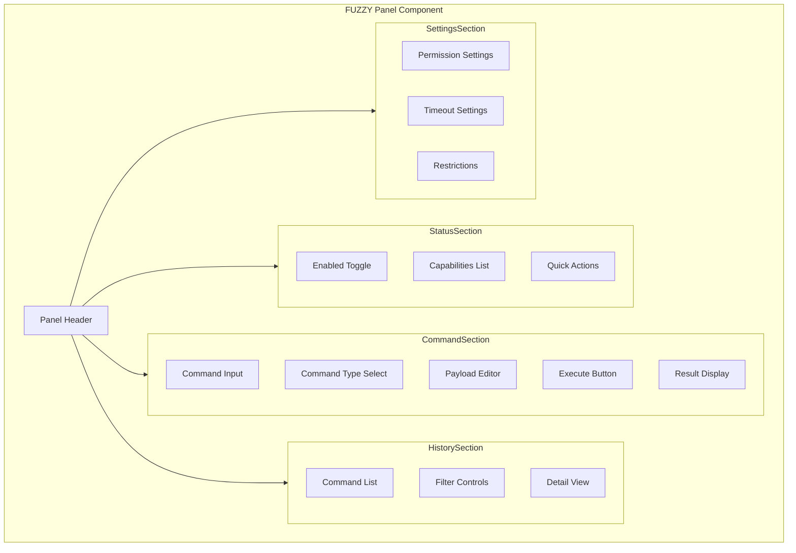

### 8.3 Workflow Builder Component

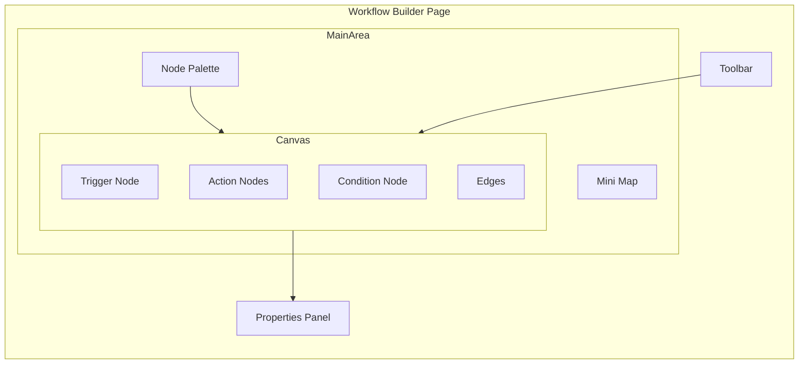

### 8.4 Component Specifications

#### Fuzzypanel.tsx

```typescript
interface FuzzypanelProps {
  agentId: string;
  onCommandExecute?: (command: MetaAgentCommand) => void;
  onStatusChange?: (status: MetaAgentStatus) => void;
}

export function Fuzzypanel({ agentId, onCommandExecute, onStatusChange }: FuzzypanelProps) {
  // Main FUZZY control panel component
  // - Displays meta-agent status
  // - Provides command input interface
  // - Shows command history
  // - Allows capability and permission management
}
```

#### WorkflowBuilder.tsx

```typescript
interface WorkflowBuilderProps {
  agentId: string;
  workflowId?: string;
  onSave?: (workflow: GeneratedWorkflow) => void;
  onExecute?: (workflowId: string) => void;
}

export function WorkflowBuilder({ agentId, workflowId, onSave, onExecute }: WorkflowBuilderProps) {
  // Visual workflow builder component
  // - Drag-and-drop node editing
  // - Node connection management
  // - AI workflow generation
  // - Template selection
  // - Execution and scheduling
}
```

#### OptimizationDashboard.tsx

```typescript
interface OptimizationDashboardProps {
  agentId?: string;
  timeRange?: TimeRange;
  onRecommendationAction?: (recommendationId: string, action: string) => void;
}

export function OptimizationDashboard({ agentId, timeRange, onRecommendationAction }: OptimizationDashboardProps) {
  // Optimization dashboard component
  // - Metrics visualization
  // - Recommendations display
  // - Alert management
  // - Performance analysis
}
```

---

## 9. Integration Points

### 9.1 Integration with Existing Agents System

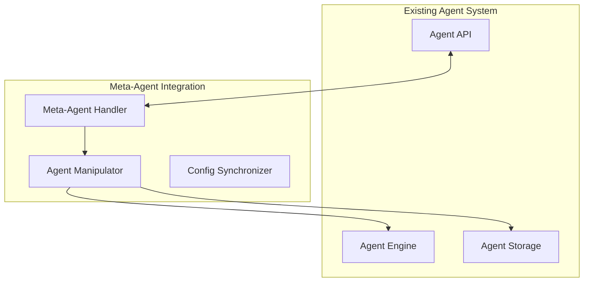

**Integration Points**:
- Meta-Agent can read/write agent configurations via [`AgentManipulator`](backend/app/core/meta_agent/handler.py)
- Configuration changes sync with existing version control system
- Agent creation/modification triggers existing validation hooks
- Subagent configurations integrate with new meta-agent capabilities

### 9.2 Integration with Templates System

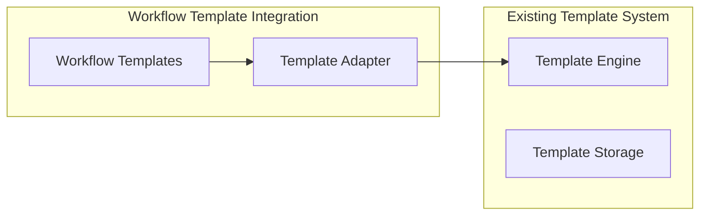

**Integration Points**:
- Workflow templates extend existing template schema
- Template rendering uses existing template engine
- Template variables support existing configuration system
- Public templates integrate with hub discovery

### 9.3 Integration with Actions System

**Integration Points**:
- Meta-Agent can generate actions using existing AI generation
- Generated workflows can include custom actions
- Action validation uses existing schema validation
- Hook system integrates with workflow execution

### 9.4 Integration Points Summary

| Feature | Integrates With | Integration Type |
|---------|-----------------|------------------|
| Meta-Agent FUZZY | Agents, Actions, Hooks | Read/Write |
| Workflow Generation | Templates, Actions, Agents | Read/Write |
| Configuration Management | All configuration sources | Read/Write |
| System Optimization | Agents, API, Database | Read Only |

---

## 10. Security Considerations

### 10.1 Permission Levels

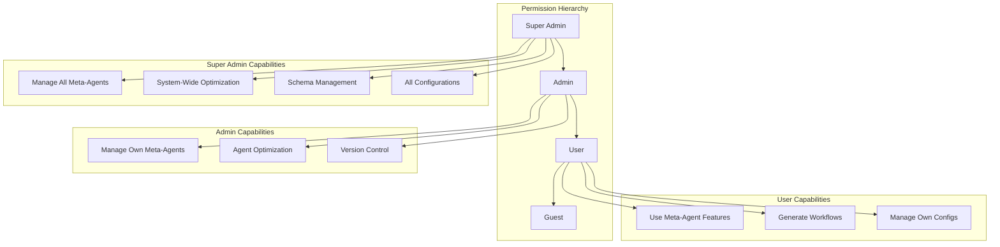

### 10.2 Permission Matrix

| Feature | Guest | User | Admin | Super Admin |
|---------|-------|------|-------|-------------|
| View Meta-Agent Status | - | Yes | Yes | Yes |
| Execute Commands | - | Limited | Yes | Yes |
| Manage Capabilities | - | - | Own | All |
| View System Metrics | - | Own | Yes | Yes |
| View Recommendations | - | Own | Yes | Yes |
| Implement Recommendations | - | Own | Own | All |
| Manage Schemas | - | - | - | Yes |
| System Optimization | - | - | - | Yes |
| View All Alerts | - | - | Own | Yes |
| Resolve Alerts | - | - | Own | All |

### 10.3 Security Restrictions

```python
# Security restrictions for Meta-Agent operations

class MetaAgentSecurity:
    """
    Security restrictions for meta-agent operations.
    """
    
    # Operations that require explicit permission
    RESTRICTED_OPERATIONS = [
        "delete_agent",
        "modify_permissions",
        "access_other_users_data",
        "system_configuration",
        "api_key_management",
    ]
    
    # Operations that require admin role
    ADMIN_ONLY_OPERATIONS = [
        "create_meta_agent",
        "delete_meta_agent",
        "view_command_history",
        "execute_system_commands",
    ]
    
    # Operations that require super_admin role
    SUPER_ADMIN_ONLY_OPERATIONS = [
        "modify_schema",
        "system_optimization",
        "view_all_metrics",
        "manage_alerts",
    ]
    
    @staticmethod
    def check_permission(user_role: str, operation: str) -> bool:
        """Check if user can perform operation."""
        if operation in MetaAgentSecurity.RESTRICTED_OPERATIONS:
            return user_role in ["admin", "super_admin"]
        if operation in MetaAgentSecurity.ADMIN_ONLY_OPERATIONS:
            return user_role in ["admin", "super_admin"]
        if operation in MetaAgentSecurity.SUPER_ADMIN_ONLY_OPERATIONS:
            return user_role == "super_admin"
        return True
    
    @staticmethod
    def get_allowed_targets(user_role: str, user_id: str) -> List[str]:
        """Get list of allowed targets for user."""
        if user_role == "super_admin":
            return ["all"]
        if user_role == "admin":
            return [user_id, "shared"]
        return [user_id]
```

### 10.4 Security Best Practices

1. **Command Validation**
   - All meta-agent commands validated against schema
   - Dangerous operations require confirmation
   - Command timeout prevents infinite loops
   - Rate limiting prevents abuse

2. **Data Isolation**
   - User data isolation enforced at database level
   - Cross-user access requires explicit permission
   - API keys encrypted at rest
   - Audit logging for all operations

3. **Access Control**
   - JWT-based authentication
   - Role-based access control (RBAC)
   - Permission checking at API level
   - Regular permission audits

4. **Audit and Compliance**
   - All commands logged with user and timestamp
   - Configuration changes versioned
   - System metrics stored for analysis
   - Alert resolution tracked

---

## 11. Implementation Roadmap

### 11.1 Sprint Breakdown

| Sprint | Focus | Deliverables |
|--------|-------|--------------|
| 37 | Meta-Agent Core | FUZZY engine, basic API, command execution |
| 38 | Workflow Generation | Template system, AI generation, workflow builder |
| 39 | Configuration Management | Schema registry, versioning, validation |
| 40 | System Optimization | Metrics collection, recommendations, dashboard |

### 11.2 Dependencies

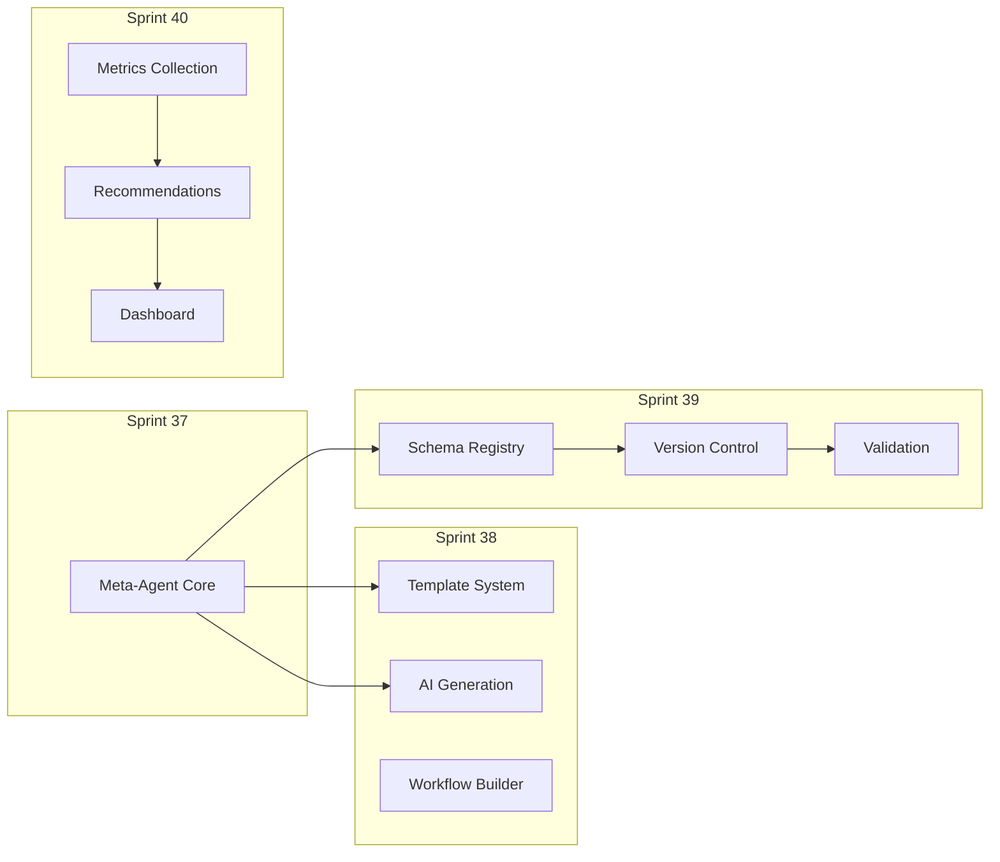

---

## 12. Appendices

### 12.1 Glossary

| Term | Definition |
|------|------------|
| FUZZY | Flexible Universal Zygotic Ystem - Meta-Agent with studio manipulation capabilities |
| Meta-Agent | Special agent type with elevated permissions for studio control |
| Workflow Template | Pre-defined workflow patterns for common automation scenarios |
| Configuration Schema | JSON Schema definitions for configuration validation |
| Optimization Recommendation | AI-generated suggestions for improving performance or reducing costs |

### 12.2 Reference Documents

- [Chronos Comprehensive Architecture](plans/chronos-comprehensive-architecture.md)
- [Chronos Hub Integration Guide](plans/chronos-hub-integration-guide.md)
- [Backend API Implementation](backend/app/api/)
- [Frontend Component Library](frontend/src/components/)

### 12.3 Version History

| Version | Date | Author | Changes |
|---------|------|--------|---------|
| 1.0 | 2026-01-09 | Architecture Team | Initial draft |

---

**Document End**

This architecture document provides comprehensive specifications for implementing Phase 4 Sprint 37-40 features. All components follow existing codebase patterns and conventions. Implementation should proceed according to the sprint breakdown and dependency graph provided.