# Sub-Agents Configuration Alignment Plan

## Executive Summary

This plan addresses the discrepancies identified in the configuration review and provides a comprehensive roadmap for aligning the Summary Agent and Translator Agent implementations with the new configuration requirements.

## 1. UI Integration Alignment Plan

### 1.1 Current State Analysis

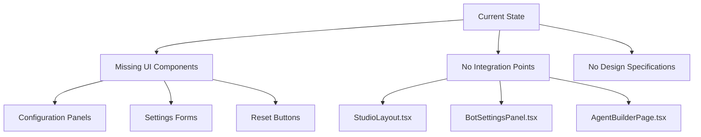

### 1.2 Target Architecture

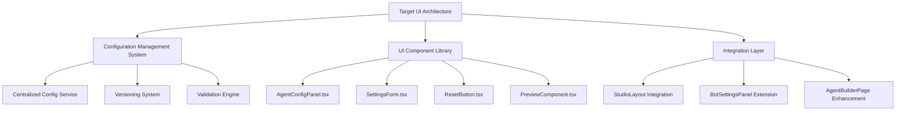

### 1.3 Implementation Steps

#### Step 1: UI Component Design

- **Action:** Create detailed wireframes and component specifications
- **Components Required:**
  - `AgentConfigPanel.tsx` - Main configuration interface
  - `SettingsForm.tsx` - Form with validation and submit handling
  - `ResetButton.tsx` - Reset to defaults with confirmation
  - `PreviewComponent.tsx` - Real-time configuration preview
  - `TemplateManager.tsx` - For Summary Agent template management
  - `TranslationMemoryManager.tsx` - For Translator Agent memory management

#### Step 2: Integration Points Definition

- **Action:** Define integration points with existing UI framework
- **Integration Points:**
  - `StudioLayout.tsx`: Add configuration tab
  - `BotSettingsPanel.tsx`: Extend with agent-specific settings
  - `AgentBuilderPage.tsx`: Add configuration section
  - `SettingsPage.tsx`: Add sub-agent configuration management

#### Step 3: Design System Integration

- **Action:** Ensure consistency with existing design system
- **Requirements:**
  - Follow existing color scheme and typography
  - Use established component patterns
  - Implement responsive design principles
  - Ensure accessibility compliance (WCAG 2.1 AA)

### 1.4 UI Component Specifications

#### AgentConfigPanel.tsx

```typescript
interface AgentConfigPanelProps {
  agentId: string;
  agentType: 'summary' | 'translator';
  currentConfig: AgentConfig;
  defaultConfig: AgentConfig;
  onSave: (config: AgentConfig) => Promise<void>;
  onReset: () => Promise<void>;
  onPreview: (config: AgentConfig) => Promise<PreviewResult>;
}

const AgentConfigPanel: React.FC<AgentConfigPanelProps> = ({
  agentId,
  agentType,
  currentConfig,
  defaultConfig,
  onSave,
  onReset,
  onPreview
}) => {
  // Implementation with tabs for different configuration sections
  // Real-time validation and error handling
  // Preview functionality
  // Reset button with confirmation dialog
};
```

#### SettingsForm.tsx

```typescript
interface SettingsFormProps {
  config: AgentConfig;
  onChange: (updatedConfig: AgentConfig) => void;
  onSubmit: () => void;
  validationErrors: ValidationError[];
}

const SettingsForm: React.FC<SettingsFormProps> = ({
  config,
  onChange,
  onSubmit,
  validationErrors
}) => {
  // Form fields with proper labels and descriptions
  // Input validation and error display
  // Field-specific help text
  // Submit and cancel buttons
};
```

## 2. Reset Functionality Alignment Plan

### 2.1 Current State Analysis

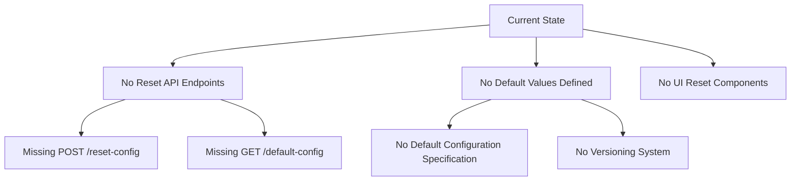

### 2.2 Target Architecture

```mermaid
graph TD
    A[Target Reset Architecture] --> B[API Layer]
    A --> C[Configuration Service]
    A --> D[UI Components]
    
    B --> E[POST /agents/{agent_id}/reset-config]
    B --> F[GET /agents/{agent_id}/default-config]
    B --> G[POST /agents/bulk-reset-config]
    
    C --> H[Default Config Repository]
    C --> I[Config Versioning System]
    C --> J[Reset Validation Service]
    
    D --> K[ResetButton Component]
    D --> L[Confirmation Dialog]
    D --> M[Reset Status Notifications]
```

### 2.3 Implementation Steps

#### Step 1: Define Default Configurations

- **Action:** Create comprehensive default configuration specifications
- **Default Configurations:**

**Summary Agent Defaults:**

```json
{
  "summary_type": "key_points",
  "default_language": "en",
  "max_summary_length": 500,
  "include_sentiment": true,
  "include_action_items": true,
  "include_speaker_attribution": false,
  "min_confidence_score": 0.8,
  "template": "standard"
}
```

**Translator Agent Defaults:**

```json
{
  "source_language": "auto",
  "target_language": "en",
  "domain": "general",
  "preserve_formatting": true,
  "use_translation_memory": true,
  "min_confidence_threshold": 0.8,
  "enable_domain_specific": true,
  "fallback_provider": "google"
}
```

#### Step 2: Implement API Endpoints

- **Action:** Add reset functionality to API layer
- **New Endpoints:**

**Reset Configuration Endpoint:**

```python
@router.post("/agents/{agent_id}/reset-config")
async def reset_agent_config(
    agent_id: int,
    current_user: User = Depends(get_current_user)
) -> AgentConfig:
    """
    Reset agent configuration to default values
    
    Args:
        agent_id: ID of the agent to reset
        current_user: Authenticated user
        
    Returns:
        Reset configuration
        
    Raises:
        HTTPException: 404 if agent not found
        HTTPException: 403 if user not authorized
    """
    # Verify agent ownership
    # Load default configuration for agent type
    # Update agent configuration
    # Return new configuration
```

**Get Default Configuration Endpoint:**

```python
@router.get("/agents/{agent_id}/default-config")
async def get_default_config(
    agent_id: int,
    current_user: User = Depends(get_current_user)
) -> AgentConfig:
    """
    Get default configuration for agent type
    
    Args:
        agent_id: ID of the agent
        current_user: Authenticated user
        
    Returns:
        Default configuration for agent type
        
    Raises:
        HTTPException: 404 if agent not found
    """
    # Get agent type
    # Return default configuration for that type
```

#### Step 3: Implement Reset Button Component

- **Action:** Create reusable reset button component
- **Component Specification:**

```typescript
interface ResetButtonProps {
  onReset: () => Promise<void>;
  disabled?: boolean;
  confirmMessage?: string;
  confirmTitle?: string;
  onSuccess?: () => void;
  onError?: (error: Error) => void;
}

const ResetButton: React.FC<ResetButtonProps> = ({
  onReset,
  disabled = false,
  confirmMessage = "Are you sure you want to reset to default values?",
  confirmTitle = "Reset Configuration",
  onSuccess,
  onError
}) => {
  const [isLoading, setIsLoading] = useState(false);
  const [showConfirm, setShowConfirm] = useState(false);
  
  const handleReset = async () => {
    try {
      setIsLoading(true);
      await onReset();
      onSuccess?.();
    } catch (error) {
      onError?.(error);
    } finally {
      setIsLoading(false);
      setShowConfirm(false);
    }
  };
  
  return (
    <>
      <Button
        variant="outline"
        color="warning"
        onClick={() => setShowConfirm(true)}
        disabled={disabled || isLoading}
        leftIcon={isLoading ? <Loader size="sm" /> : <ResetIcon />}
      >
        {isLoading ? 'Resetting...' : 'Reset to Defaults'}
      </Button>
      
      <ConfirmationDialog
        isOpen={showConfirm}
        onClose={() => setShowConfirm(false)}
        onConfirm={handleReset}
        title={confirmTitle}
        message={confirmMessage}
        confirmText="Reset"
        confirmColor="warning"
      />
    </>
  );
};
```

## 3. Configuration Management Alignment Plan

### 3.1 Current State Analysis

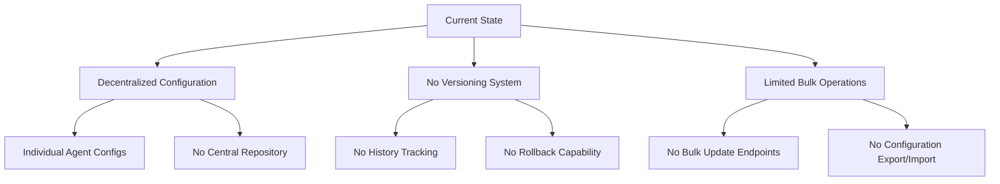

### 3.2 Target Architecture

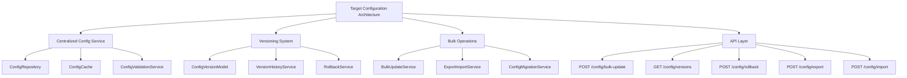

### 3.3 Implementation Steps

#### Step 1: Centralized Configuration Service

- **Action:** Create centralized configuration management service
- **Service Components:**

**ConfigRepository Interface:**

```python
class ConfigRepository(ABC):
    @abstractmethod
    async def get_config(self, agent_id: int) -> AgentConfig: ...
    
    @abstractmethod
    async def update_config(self, agent_id: int, config: AgentConfig) -> AgentConfig: ...
    
    @abstractmethod
    async def reset_config(self, agent_id: int) -> AgentConfig: ...
    
    @abstractmethod
    async def get_default_config(self, agent_type: str) -> AgentConfig: ...
    
    @abstractmethod
    async def bulk_update(self, updates: List[Tuple[int, AgentConfig]]) -> List[AgentConfig]: ...
    
    @abstractmethod
    async def get_version_history(self, agent_id: int) -> List[ConfigVersion]: ...
    
    @abstractmethod
    async def rollback_config(self, agent_id: int, version_id: str) -> AgentConfig: ...
```

**ConfigValidationService:**

```python
class ConfigValidationService:
    def __init__(self, agent_type_schemas: Dict[str, Type[BaseModel]]):
        self.agent_type_schemas = agent_type_schemas
    
    def validate_config(self, agent_type: str, config: Dict) -> AgentConfig:
        """Validate configuration against schema"""
        schema = self.agent_type_schemas[agent_type]
        return schema(**config)
    
    def get_default_config(self, agent_type: str) -> AgentConfig:
        """Get default configuration for agent type"""
        schema = self.agent_type_schemas[agent_type]
        return schema()
```

#### Step 2: Versioning System Implementation

- **Action:** Implement configuration versioning and history tracking
- **Database Models:**

**ConfigVersion Model:**

```python
class ConfigVersion(BaseModel):
    __tablename__ = "config_versions"
    
    id = Column(String(50), primary_key=True, default=lambda: str(uuid.uuid4()))
    agent_id = Column(Integer, ForeignKey("agents.id"), index=True)
    version = Column(Integer, default=1)
    config_data = Column(JSON, nullable=False)
    created_at = Column(DateTime, default=datetime.utcnow)
    created_by = Column(String(50), nullable=True)
    change_description = Column(Text, nullable=True)
    
    agent = relationship("AgentModel")
```

**VersionHistoryService:**

```python
class VersionHistoryService:
    def __init__(self, db_session: Session):
        self.db = db_session
    
    async def create_version(self, agent_id: int, config: AgentConfig, 
                           user_id: str, description: str = "Configuration update") -> ConfigVersion:
        """Create new configuration version"""
        # Get current version number
        # Create new version record
        # Return created version
    
    async def get_version_history(self, agent_id: int) -> List[ConfigVersion]:
        """Get version history for agent"""
        # Query version records
        # Return sorted by version number
    
    async def rollback_to_version(self, agent_id: int, version_id: str) -> AgentConfig:
        """Rollback to specific version"""
        # Get version record
        # Update current config
        # Create new version record
        # Return rolled back config
```

#### Step 3: Bulk Operations Implementation

- **Action:** Implement bulk configuration operations
- **API Endpoints:**

**Bulk Update Endpoint:**

```python
@router.post("/config/bulk-update")
async def bulk_update_config(
    updates: List[AgentConfigUpdate],
    current_user: User = Depends(get_current_user)
) -> List[BulkUpdateResult]:
    """
    Bulk update multiple agent configurations
    
    Args:
        updates: List of agent ID and config updates
        current_user: Authenticated user
        
    Returns:
        List of update results with success/failure status
        
    Raises:
        HTTPException: 403 if user not authorized for any agent
    """
    results = []
    for update in updates:
        try:
            # Verify ownership
            # Validate config
            # Update config
            # Create version
            results.append(BulkUpdateResult(success=True, agent_id=update.agent_id))
        except Exception as e:
            results.append(BulkUpdateResult(success=False, agent_id=update.agent_id, error=str(e)))
    
    return results
```

**Export Configuration Endpoint:**

```python
@router.post("/config/export")
async def export_config(
    agent_ids: List[int],
    current_user: User = Depends(get_current_user)
) -> ConfigExport:
    """
    Export agent configurations
    
    Args:
        agent_ids: List of agent IDs to export
        current_user: Authenticated user
        
    Returns:
        Configuration export data
        
    Raises:
        HTTPException: 403 if user not authorized for any agent
    """
    # Verify ownership for all agents
    # Get current configurations
    # Return export data
```

## 4. Integration Workflow

### 4.1 Complete Integration Sequence

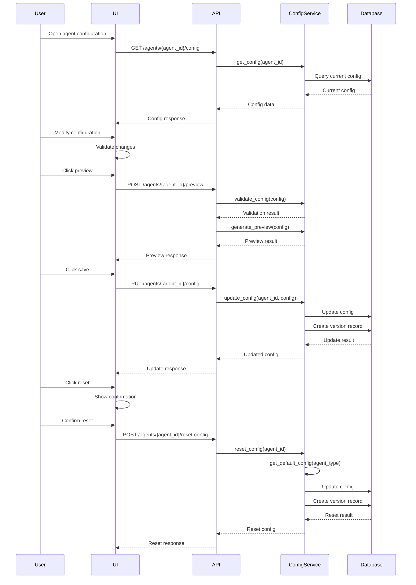

### 4.2 UI Integration Points

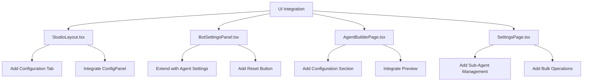

## 5. Implementation Priority Matrix

### 5.1 Priority Levels

| Priority | Description | Components |
|----------|-------------|------------|
| P0 (Critical) | Required for basic functionality | Reset API, Default configs, Basic UI |
| P1 (High) | Required for complete functionality | Config service, Versioning, UI integration |
| P2 (Medium) | Enhancements for better UX | Bulk operations, Export/import, Advanced UI |
| P3 (Low) | Nice-to-have features | Configuration templates, Presets, Sharing |

### 5.2 Implementation Roadmap

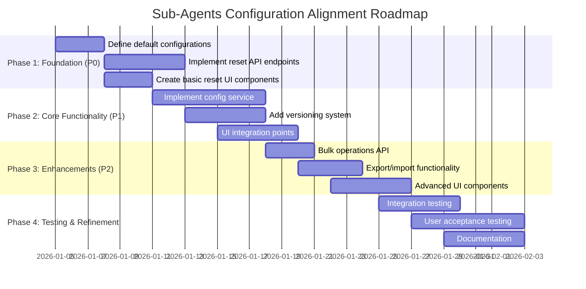

## 6. Testing Strategy

### 6.1 Test Coverage Requirements

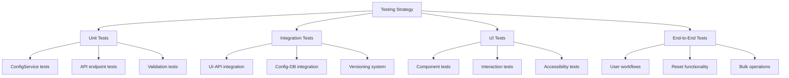

### 6.2 Test Cases

**Reset Functionality Tests:**

- Reset single agent configuration
- Reset multiple agents (bulk)
- Reset with invalid agent ID
- Reset without proper authorization
- Verify default values after reset

**UI Integration Tests:**

- Configuration panel rendering
- Form validation and submission
- Reset button functionality
- Preview functionality
- Error handling and notifications

**Configuration Management Tests:**

- Version history tracking
- Rollback to previous versions
- Bulk configuration updates
- Export and import configurations
- Configuration validation

## 7. Documentation Requirements

### 7.1 Documentation Deliverables

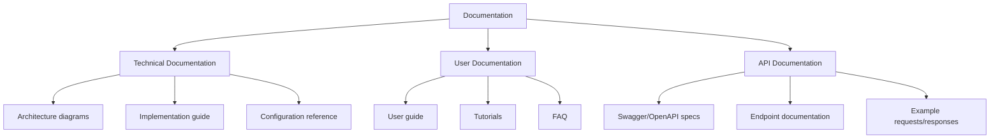

### 7.2 Documentation Outline

**Technical Documentation:**

1. Configuration Architecture Overview
2. Component Diagrams and Flowcharts
3. API Specifications and Contracts
4. Database Schema and Models
5. Integration Guide for Developers

**User Documentation:**

1. Getting Started with Agent Configuration
2. Configuration Management Guide
3. Reset to Defaults Tutorial
4. Bulk Operations Guide
5. Troubleshooting and FAQ

## 8. Success Criteria

### 8.1 Technical Success Criteria

- ✅ All API endpoints implemented and documented
- ✅ UI components integrated and functional
- ✅ Configuration service operational
- ✅ Versioning and history tracking working
- ✅ Reset functionality fully implemented
- ✅ Comprehensive test coverage (>85%)
- ✅ Performance targets met (<500ms response time)

### 8.2 User Success Criteria

- ✅ Intuitive configuration management interface
- ✅ Easy reset to defaults functionality
- ✅ Clear error messages and validation
- ✅ Responsive and accessible UI
- ✅ Comprehensive user documentation
- ✅ Positive user feedback on usability

## 9. Risk Assessment and Mitigation

### 9.1 Key Risks and Mitigation Strategies

| Risk | Impact | Likelihood | Mitigation Strategy |
|------|--------|-----------|---------------------|
| Integration complexity | High | Medium | Incremental integration, thorough testing |
| UI consistency issues | Medium | High | Design system integration, component library |
| Performance bottlenecks | High | Low | Caching, async operations, load testing |
| Configuration conflicts | Medium | Medium | Validation service, conflict resolution |
| User adoption challenges | Medium | High | Comprehensive documentation, tutorials |
| Security vulnerabilities | High | Low | Security review, penetration testing |

### 9.2 Risk Monitoring Plan

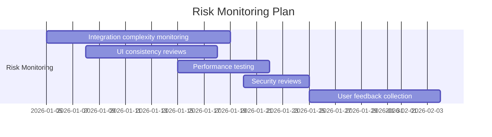

## 10. Conclusion

This comprehensive alignment plan addresses all discrepancies identified in the configuration review and provides a clear roadmap for implementing the required functionality. The plan is structured in phases to ensure systematic progress and includes detailed specifications for all major components.

### Key Deliverables

1. **UI Integration:** Complete configuration management interface
2. **Reset Functionality:** Full reset to defaults implementation
3. **Configuration Management:** Centralized service with versioning
4. **API Enhancements:** New endpoints for configuration operations
5. **Testing and Documentation:** Comprehensive coverage

### Implementation Approach

- Phase 1: Foundation (Critical functionality)
- Phase 2: Core Functionality (Complete feature set)
- Phase 3: Enhancements (Improved user experience)
- Phase 4: Testing and Refinement (Quality assurance)

This plan ensures that both the Summary Agent and Translator Agent implementations will be fully aligned with the new configuration requirements, providing users with a robust and intuitive configuration management system.
