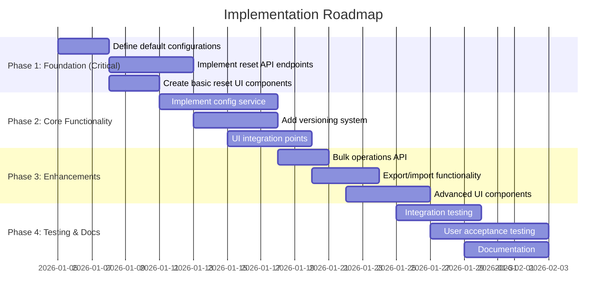
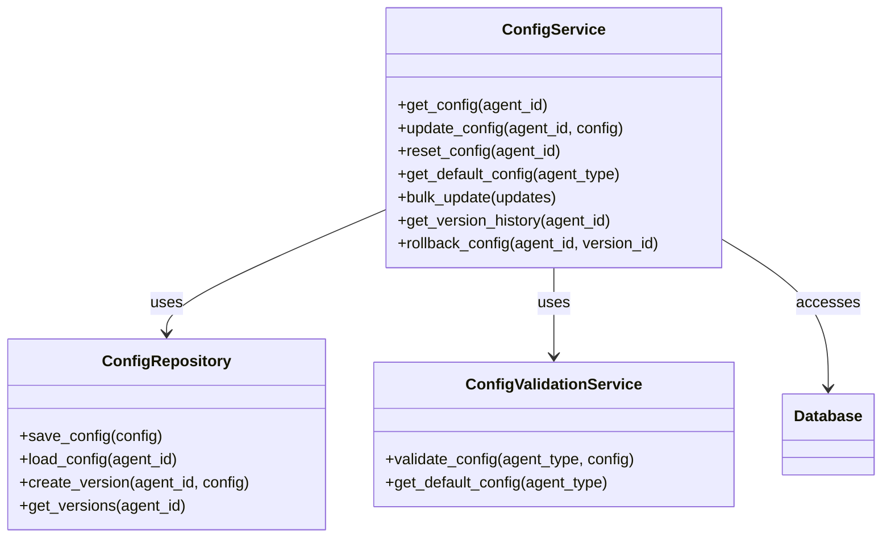
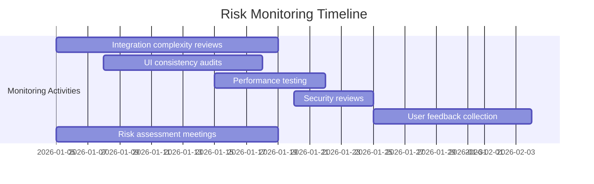

# Sub-Agents Configuration - Final Recommendations

## Executive Summary

This document provides the final recommendations based on the comprehensive review of the Summary Agent and Translator Agent implementation plans. The review identified critical gaps in UI integration, reset functionality, and configuration management that need to be addressed to align with the new configuration requirements.

## 1. Review Findings Summary

### 1.1 Strengths Identified

**✅ Well-Implemented Aspects:**
- **Technical Architecture:** Both agents have solid technical foundations with clear component diagrams and sequence flows
- **API Design:** Comprehensive API specifications with proper request/response examples
- **Data Models:** Well-defined database schemas and Pydantic models
- **Configuration Structure:** Good organization of configuration settings and environment variables
- **Error Handling:** Comprehensive error types and response formats
- **Performance Considerations:** Thoughtful optimization strategies and metrics

**✅ Common Positive Patterns:**
- Consistent architectural patterns between agents
- Similar database schema design approach
- Uniform use of Pydantic schemas for validation
- WebSocket integration for real-time operations
- Performance metrics tracking
- Comprehensive error handling

### 1.2 Critical Gaps Identified

**❌ Major Discrepancies Found:**

| Area | Summary Agent | Translator Agent | Required Fix |
|------|---------------|------------------|--------------|
| **UI Integration** | ❌ Missing | ❌ Missing | Complete UI implementation |
| **Reset Functionality** | ❌ Missing | ❌ Missing | API + UI reset implementation |
| **Configuration Management** | ❌ Decentralized | ❌ Decentralized | Centralized service |
| **Default Values** | ❌ Not specified | ❌ Not specified | Define defaults |
| **UI Components** | ❌ None | ❌ None | Full component library |
| **Integration Points** | ❌ None | ❌ None | Define UI integration |

## 2. Alignment Requirements

### 2.1 UI Integration Requirements

**Critical UI Components Needed:**

1. **AgentConfigPanel.tsx** - Main configuration interface with tabs
2. **SettingsForm.tsx** - Form with validation and error handling
3. **ResetButton.tsx** - Reset to defaults with confirmation dialog
4. **PreviewComponent.tsx** - Real-time configuration preview
5. **TemplateManager.tsx** - Summary Agent template management
6. **TranslationMemoryManager.tsx** - Translator Agent memory management

**Required Integration Points:**
- `StudioLayout.tsx`: Add configuration tab
- `BotSettingsPanel.tsx`: Extend with agent-specific settings  
- `AgentBuilderPage.tsx`: Add configuration section
- `SettingsPage.tsx`: Add sub-agent configuration management

### 2.2 Reset Functionality Requirements

**API Endpoints Required:**
- `POST /api/v1/agents/{agent_id}/reset-config` - Reset to defaults
- `GET /api/v1/agents/{agent_id}/default-config` - Get default values
- `POST /api/v1/agents/bulk-reset-config` - Bulk reset operations

**Default Configuration Specifications:**

**Summary Agent Defaults:**
```json
{
  "summary_type": "key_points",
  "default_language": "en", 
  "max_summary_length": 500,
  "include_sentiment": true,
  "include_action_items": true,
  "include_speaker_attribution": false,
  "min_confidence_score": 0.8,
  "template": "standard"
}
```

**Translator Agent Defaults:**
```json
{
  "source_language": "auto",
  "target_language": "en",
  "domain": "general",
  "preserve_formatting": true,
  "use_translation_memory": true,
  "min_confidence_threshold": 0.8,
  "enable_domain_specific": true,
  "fallback_provider": "google"
}
```

### 2.3 Configuration Management Requirements

**Centralized Configuration Service:**
- ConfigRepository interface and implementations
- ConfigValidationService for schema validation
- VersionHistoryService for tracking changes
- BulkUpdateService for multiple agent operations

**Database Models Required:**
- ConfigVersion model for version tracking
- Configuration audit logging
- User-specific vs global defaults

## 3. Implementation Roadmap

### 3.1 Phased Implementation Approach



### 3.2 Priority Matrix

| Priority | Category | Components |
|----------|----------|------------|
| **P0 (Critical)** | Basic Functionality | Reset API, Default configs, Basic UI |
| **P1 (High)** | Complete Functionality | Config service, Versioning, UI integration |
| **P2 (Medium)** | Enhanced UX | Bulk operations, Export/import, Advanced UI |
| **P3 (Low)** | Nice-to-have | Configuration templates, Presets, Sharing |

## 4. Technical Recommendations

### 4.1 Architecture Recommendations

**Adopt Centralized Configuration Pattern:**


### 4.2 API Design Recommendations

**Follow RESTful Patterns:**
- Use consistent naming conventions
- Implement proper HTTP methods (GET, POST, PUT, DELETE)
- Include comprehensive error handling
- Support pagination for version history
- Implement proper authentication and authorization

**API Versioning:**
- Use `/api/v1/` prefix for all endpoints
- Plan for future version compatibility
- Implement deprecation warnings

### 4.3 UI/UX Recommendations

**Design System Integration:**
- Follow existing color scheme and typography
- Use established component patterns
- Implement responsive design principles
- Ensure accessibility compliance (WCAG 2.1 AA)
- Provide clear error messages and validation

**User Experience:**
- Real-time preview functionality
- Confirmation dialogs for destructive actions
- Loading states and progress indicators
- Success/error notifications
- Help text and tooltips

## 5. Testing Strategy Recommendations

### 5.1 Test Coverage Requirements

**Minimum Test Coverage:**
- **Unit Tests:** 90% code coverage
- **Integration Tests:** 85% coverage
- **UI Tests:** 80% component coverage
- **End-to-End Tests:** Critical user workflows

### 5.2 Test Categories

**Unit Tests:**
- ConfigService functionality
- API endpoint validation
- Configuration validation logic
- Versioning system operations

**Integration Tests:**
- UI-API integration
- Config-DB integration
- Versioning system workflows
- Authentication and authorization

**UI Tests:**
- Component rendering and interaction
- Form validation and submission
- Reset button functionality
- Preview functionality
- Error handling and notifications

**End-to-End Tests:**
- Complete user workflows
- Reset functionality scenarios
- Bulk operations workflows
- Configuration export/import

## 6. Documentation Recommendations

### 6.1 Documentation Deliverables

**Technical Documentation:**
- Architecture overview with diagrams
- API specifications (OpenAPI/Swagger)
- Database schema documentation
- Integration guide for developers
- Configuration reference guide

**User Documentation:**
- Getting started guide
- Configuration management tutorial
- Reset functionality guide
- Bulk operations guide
- Troubleshooting and FAQ

### 6.2 Documentation Standards

**Format Requirements:**
- Use Markdown for technical docs
- Include code examples and snippets
- Provide screenshots for UI documentation
- Use consistent terminology
- Include version information

**Quality Standards:**
- Clear and concise language
- Step-by-step instructions
- Comprehensive examples
- Cross-references between documents
- Regular updates and maintenance

## 7. Risk Assessment and Mitigation

### 7.1 Key Risks and Recommendations

| Risk | Impact | Likelihood | Mitigation Strategy |
|------|--------|-----------|---------------------|
| **Integration Complexity** | High | Medium | Incremental integration, thorough testing, clear documentation |
| **UI Consistency Issues** | Medium | High | Design system integration, component library, UI reviews |
| **Performance Bottlenecks** | High | Low | Caching, async operations, load testing, performance monitoring |
| **Configuration Conflicts** | Medium | Medium | Validation service, conflict resolution, user notifications |
| **User Adoption Challenges** | Medium | High | Comprehensive documentation, tutorials, user testing, feedback collection |
| **Security Vulnerabilities** | High | Low | Security review, penetration testing, access control, audit logging |
| **Data Migration Issues** | Medium | Medium | Migration scripts, backup procedures, rollback plans |

### 7.2 Risk Monitoring Plan



## 8. Success Criteria

### 8.1 Technical Success Metrics

**API Implementation:**
- ✅ All required API endpoints implemented
- ✅ Comprehensive error handling
- ✅ Proper authentication and authorization
- ✅ API documentation complete

**Configuration Service:**
- ✅ Centralized configuration management
- ✅ Versioning and history tracking
- ✅ Bulk operations support
- ✅ Validation and conflict resolution

**UI Implementation:**
- ✅ All required UI components implemented
- ✅ Proper integration with existing UI
- ✅ Responsive and accessible design
- ✅ Real-time preview functionality

**Testing and Quality:**
- ✅ Unit test coverage > 90%
- ✅ Integration test coverage > 85%
- ✅ UI test coverage > 80%
- ✅ End-to-end test coverage for critical workflows
- ✅ Performance targets met (<500ms response time)
- ✅ Security review completed

### 8.2 User Success Metrics

**Usability:**
- ✅ Intuitive configuration management interface
- ✅ Easy reset to defaults functionality
- ✅ Clear error messages and validation
- ✅ Comprehensive help and documentation

**Adoption:**
- ✅ Positive user feedback on functionality
- ✅ Successful adoption by target user base
- ✅ Minimal support requests post-launch
- ✅ High user satisfaction ratings

**Functionality:**
- ✅ All configuration options accessible
- ✅ Reset functionality working correctly
- ✅ Bulk operations functional
- ✅ Versioning and history tracking operational

## 9. Implementation Checklist

### 9.1 Pre-Implementation Checklist

- [ ] Review and approve final recommendations
- [ ] Assign implementation team members
- [ ] Set up development environment
- [ ] Create project tracking (Jira/GitHub issues)
- [ ] Schedule implementation phases
- [ ] Prepare test environments
- [ ] Set up monitoring and logging

### 9.2 Implementation Checklist

**Phase 1: Foundation**
- [ ] Define default configurations for both agents
- [ ] Implement reset API endpoints
- [ ] Create basic reset UI components
- [ ] Set up configuration database tables
- [ ] Implement basic validation service

**Phase 2: Core Functionality**
- [ ] Implement centralized config service
- [ ] Add versioning system
- [ ] Create UI integration points
- [ ] Implement configuration validation
- [ ] Add error handling and logging

**Phase 3: Enhancements**
- [ ] Implement bulk operations API
- [ ] Add export/import functionality
- [ ] Create advanced UI components
- [ ] Implement performance optimization
- [ ] Add caching mechanisms

**Phase 4: Testing and Documentation**
- [ ] Complete unit testing
- [ ] Perform integration testing
- [ ] Conduct UI testing
- [ ] Execute end-to-end testing
- [ ] Write technical documentation
- [ ] Create user documentation
- [ ] Develop tutorials and examples

### 9.3 Post-Implementation Checklist

- [ ] Deploy to staging environment
- [ ] Conduct user acceptance testing
- [ ] Collect and incorporate user feedback
- [ ] Perform security review
- [ ] Complete performance testing
- [ ] Finalize documentation
- [ ] Plan production deployment
- [ ] Set up monitoring and alerts
- [ ] Schedule post-launch review

## 10. Final Recommendations

### 10.1 Immediate Actions

1. **Approve Implementation Plan:** Review and approve the comprehensive alignment plan
2. **Assign Resources:** Allocate development team members and resources
3. **Set Timeline:** Establish realistic implementation timeline
4. **Prepare Environment:** Set up development and testing environments
5. **Begin Phase 1:** Start with foundation implementation

### 10.2 Long-Term Recommendations

1. **Continuous Improvement:** Regularly review and enhance configuration management
2. **User Feedback:** Establish ongoing user feedback collection mechanism
3. **Performance Monitoring:** Implement continuous performance monitoring
4. **Security Updates:** Regular security reviews and updates
5. **Feature Expansion:** Plan for future enhancements and new features

### 10.3 Success Factors

**Key Success Factors:**
- Strong leadership and clear ownership
- Effective communication and collaboration
- Comprehensive testing and quality assurance
- User-centric design and development
- Continuous monitoring and improvement
- Regular progress reviews and adjustments

## Conclusion

This comprehensive review and alignment plan addresses all critical gaps identified in the Summary Agent and Translator Agent implementation plans. The proposed solution provides a clear roadmap for implementing the required UI integration, reset functionality, and configuration management features.

### Summary of Key Deliverables:

1. **Complete UI Integration:** Full configuration management interface with all required components
2. **Reset Functionality:** Comprehensive reset to defaults implementation with API and UI
3. **Configuration Management:** Centralized service with versioning, bulk operations, and validation
4. **API Enhancements:** New endpoints for comprehensive configuration operations
5. **Testing and Documentation:** Comprehensive coverage ensuring quality and usability

### Implementation Benefits:

- **Improved User Experience:** Intuitive configuration management interface
- **Enhanced Functionality:** Complete feature set for configuration operations
- **Better Maintainability:** Centralized configuration management system
- **Increased Reliability:** Comprehensive testing and validation
- **Future Scalability:** Architecture designed for growth and expansion

By following this comprehensive plan, the Chronos AI Agent Builder Studio will achieve full alignment with the new configuration requirements, providing users with a robust, intuitive, and feature-complete configuration management system for sub-agents.