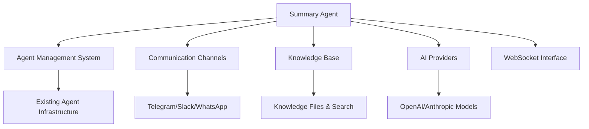
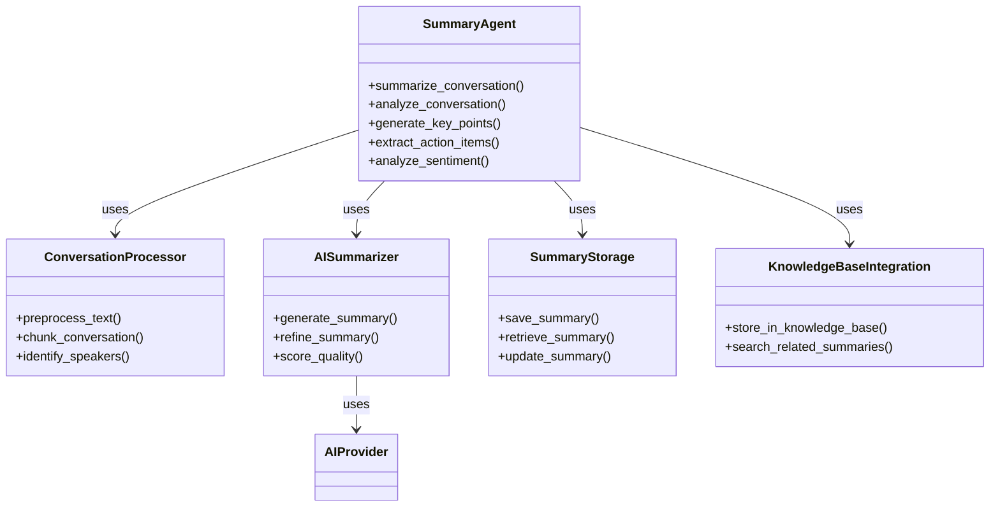
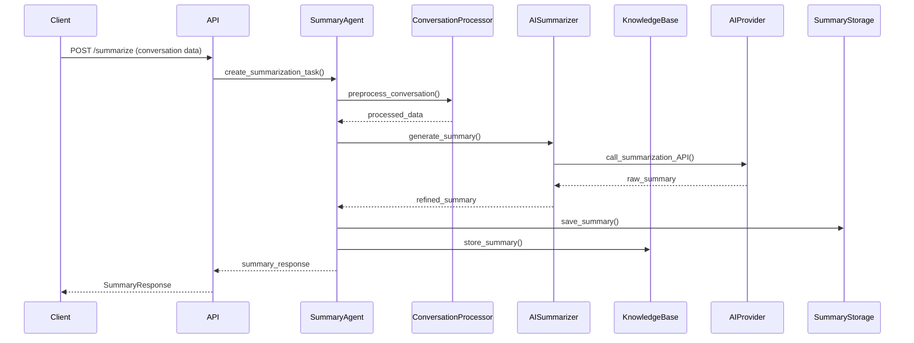

# Summary Agent Implementation Plan

## 1. Overview

The Summary Agent is a specialized subagent designed to provide conversation summarization capabilities within the Chronos AI Agent Builder Studio. This agent will analyze conversations and generate concise summaries, enabling users to quickly understand key points and action items from lengthy discussions.

## 2. Core Functionalities

### 2.1 Primary Capabilities

- **Real-time Conversation Summarization**: Generate summaries during ongoing conversations
- **Post-conversation Analysis**: Create comprehensive summaries after conversations complete
- **Key Point Extraction**: Identify and highlight important discussion points
- **Action Item Detection**: Extract tasks, decisions, and follow-up items
- **Multi-format Output**: Support text, bullet points, and structured formats
- **Customizable Summary Length**: Allow users to specify summary length preferences
- **Language Support**: Multi-language summarization capabilities

### 2.2 Advanced Features

- **Context-aware Summarization**: Maintain context across conversation threads
- **Speaker Identification**: Attribute key points to specific participants
- **Sentiment Analysis**: Include emotional tone and sentiment in summaries
- **Topic Clustering**: Group related discussion points together
- **Custom Templates**: Allow users to define summary formats and structures
- **Summarization Quality Scoring**: Provide confidence scores for generated summaries

## 3. System Integration

### 3.1 Integration Points



### 3.2 Integration Strategy

1. **Agent Type Extension**: Add `agent_type` field to distinguish Summary Agents from regular agents
2. **Specialized Endpoints**: Create dedicated API endpoints for summary operations
3. **Event-driven Architecture**: Use WebSocket events for real-time summarization
4. **Knowledge Base Integration**: Store summaries as knowledge files for future reference
5. **Communication Channel Hooks**: Integrate with existing communication channels

## 4. API Specifications

### 4.1 New Endpoints

#### Summary Agent Management
- `POST /api/v1/agents/summary` - Create a new Summary Agent
- `GET /api/v1/agents/summary` - List user's Summary Agents
- `GET /api/v1/agents/summary/{agent_id}` - Get specific Summary Agent details

#### Summarization Operations
- `POST /api/v1/summary/{agent_id}/summarize` - Generate summary from conversation
- `POST /api/v1/summary/{agent_id}/analyze` - Advanced conversation analysis
- `GET /api/v1/summary/{agent_id}/history` - Get summarization history
- `POST /api/v1/summary/{agent_id}/templates` - Manage summary templates

#### Real-time Operations
- `POST /api/v1/summary/{agent_id}/start-realtime` - Start real-time summarization
- `POST /api/v1/summary/{agent_id}/stop-realtime` - Stop real-time summarization
- `GET /api/v1/summary/{agent_id}/realtime-status` - Get real-time status

### 4.2 WebSocket Events

- `summary_agent:start` - Start summarization session
- `summary_agent:progress` - Real-time summarization progress updates
- `summary_agent:complete` - Summarization completed
- `summary_agent:error` - Summarization error occurred

### 4.3 Request/Response Examples

**Create Summary Request:**
```json
{
  "conversation_text": "Full conversation text here...",
  "summary_type": "key_points",
  "max_length": "medium",
  "language": "en",
  "include_sentiment": true,
  "template_id": null
}
```

**Summary Response:**
```json
{
  "summary_id": "sum_123456789",
  "summary_text": "Concise summary of the conversation...",
  "key_points": [
    "Main discussion point 1",
    "Main discussion point 2"
  ],
  "action_items": [
    {"task": "Follow up with client", "assignee": "John", "due_date": "2023-12-15"}
  ],
  "sentiment_score": 0.85,
  "confidence_score": 0.92,
  "language": "en",
  "created_at": "2023-12-14T10:30:00Z",
  "processing_time_ms": 1250
}
```

## 5. Data Models

### 5.1 Database Schema Extensions

#### SummaryAgent Model (extends AgentModel)
```python
class SummaryAgent(AgentModel):
    __tablename__ = "summary_agents"
    
    # Summary-specific configuration
    agent_id = Column(Integer, ForeignKey("agents.id"), primary_key=True)
    summary_type = Column(String(50), default="key_points")  # key_points, full, executive
    default_language = Column(String(10), default="en")
    max_summary_length = Column(Integer, default=500)  # characters
    include_sentiment = Column(Boolean, default=True)
    include_action_items = Column(Boolean, default=True)
    include_speaker_attribution = Column(Boolean, default=False)
    
    # Performance metrics
    avg_processing_time = Column(Float, default=0.0)
    avg_confidence_score = Column(Float, default=0.0)
    total_summaries = Column(Integer, default=0)
    
    # Relationships
    agent = relationship("AgentModel", back_populates="summary_config")
    summaries = relationship("ConversationSummary", back_populates="summary_agent")
    templates = relationship("SummaryTemplate", back_populates="summary_agent")
```

#### ConversationSummary Model
```python
class ConversationSummary(BaseModel):
    __tablename__ = "conversation_summaries"
    
    # Summary content
    conversation_id = Column(String(100), index=True)
    summary_text = Column(Text, nullable=False)
    summary_type = Column(String(50), nullable=False)
    key_points = Column(JSON, nullable=True)
    action_items = Column(JSON, nullable=True)
    sentiment_analysis = Column(JSON, nullable=True)
    confidence_score = Column(Float, nullable=False)
    language = Column(String(10), default="en")
    
    # Metadata
    original_length = Column(Integer)  # characters
    summary_length = Column(Integer)  # characters
    processing_time_ms = Column(Integer)
    
    # Relationships
    agent_id = Column(Integer, ForeignKey("agents.id"))
    summary_agent_id = Column(Integer, ForeignKey("summary_agents.agent_id"))
    knowledge_file_id = Column(Integer, ForeignKey("knowledge_files.id"), nullable=True)
    
    agent = relationship("AgentModel")
    summary_agent = relationship("SummaryAgent")
    knowledge_file = relationship("KnowledgeFile")
```

#### SummaryTemplate Model
```python
class SummaryTemplate(BaseModel):
    __tablename__ = "summary_templates"
    
    name = Column(String(100), nullable=False)
    description = Column(Text, nullable=True)
    template_content = Column(Text, nullable=False)  # Jinja2 template
    template_type = Column(String(50), default="standard")  # standard, custom, professional
    
    # Relationships
    summary_agent_id = Column(Integer, ForeignKey("summary_agents.agent_id"))
    summary_agent = relationship("SummaryAgent")
```

### 5.2 Pydantic Schemas

#### SummaryAgentCreate
```python
class SummaryAgentCreate(AgentCreate):
    summary_type: str = "key_points"
    default_language: str = "en"
    max_summary_length: int = 500
    include_sentiment: bool = True
    include_action_items: bool = True
    include_speaker_attribution: bool = False
```

#### SummaryRequest
```python
class SummaryRequest(BaseModel):
    conversation_text: str
    summary_type: str = "key_points"
    max_length: str = "medium"  # short, medium, long
    language: str = "en"
    include_sentiment: bool = True
    include_action_items: bool = True
    template_id: Optional[int] = None
    conversation_metadata: Optional[Dict[str, Any]] = None
```

#### SummaryResponse
```python
class SummaryResponse(BaseModel):
    summary_id: str
    summary_text: str
    key_points: List[str]
    action_items: List[Dict[str, Any]]
    sentiment_analysis: Optional[Dict[str, Any]]
    confidence_score: float
    language: str
    created_at: datetime
    processing_time_ms: int
    metadata: Optional[Dict[str, Any]]
```

## 6. Technical Architecture

### 6.1 Component Diagram



### 6.2 Sequence Diagram



### 6.3 Implementation Layers

1. **API Layer**: FastAPI endpoints for summary operations
2. **Service Layer**: Business logic and orchestration
3. **Processing Layer**: Text preprocessing and analysis
4. **AI Layer**: Integration with AI providers for summarization
5. **Storage Layer**: Database operations and knowledge base integration
6. **Integration Layer**: Communication with other system components

## 7. Implementation Steps

### 7.1 Phase 1: Foundation

1. **Database Schema Updates**
   - Add `agent_type` field to `AgentModel`
   - Create `SummaryAgent` extension table
   - Create `ConversationSummary` table
   - Create `SummaryTemplate` table

2. **Core Models Implementation**
   - Implement SQLAlchemy models
   - Create Pydantic schemas
   - Add validation logic

3. **Basic API Endpoints**
   - Create summary agent CRUD endpoints
   - Implement basic summarization endpoint
   - Add error handling and validation

### 7.2 Phase 2: Core Functionality

1. **Conversation Processing**
   - Text preprocessing (cleaning, normalization)
   - Speaker identification
   - Conversation chunking

2. **AI Integration**
   - OpenAI summarization API integration
   - Anthropic API integration
   - Fallback mechanisms

3. **Summary Generation**
   - Key point extraction
   - Action item detection
   - Sentiment analysis
   - Quality scoring

### 7.3 Phase 3: Advanced Features

1. **Real-time Summarization**
   - WebSocket integration
   - Streaming summary updates
   - Progress tracking

2. **Template System**
   - Template creation and management
   - Jinja2 template rendering
   - Custom format support

3. **Knowledge Base Integration**
   - Automatic storage of summaries
   - Search and retrieval
   - Cross-reference capabilities

### 7.4 Phase 4: Integration & Testing

1. **System Integration**
   - Communication channel hooks
   - Agent management integration
   - WebSocket event system

2. **Testing**
   - Unit tests for all components
   - Integration tests
   - Performance testing
   - User acceptance testing

3. **Documentation**
   - API documentation
   - User guides
   - Technical documentation

## 8. Dependencies

### 8.1 Existing System Dependencies

- `AgentModel` and agent management system
- `KnowledgeFile` and knowledge base system
- AI provider integration layer
- WebSocket communication system
- Authentication and authorization system

### 8.2 New Dependencies

- `python-dotenv` (for environment variables)
- `jinja2` (for template rendering)
- `nltk` or `spaCy` (for text processing)
- `textblob` or similar (for sentiment analysis)
- Additional AI provider SDKs as needed

### 8.3 External Services

- OpenAI API (for summarization)
- Anthropic API (alternative provider)
- Optional: Custom ML models for specialized summarization

## 9. Configuration

### 9.1 Environment Variables

```env
# Summary Agent Configuration
SUMMARY_DEFAULT_MODEL="gpt-4"
SUMMARY_MAX_LENGTH=1000
SUMMARY_TIMEOUT_SECONDS=60
SUMMARY_ENABLE_SENTIMENT=true
SUMMARY_ENABLE_ACTION_ITEMS=true

# AI Provider Configuration
OPENAI_API_KEY="your-api-key"
ANTHROPIC_API_KEY="your-api-key"
SUMMARY_FALLBACK_PROVIDER="openai"
```

### 9.2 Agent Configuration

```json
{
  "summary_agent": {
    "default_settings": {
      "summary_type": "key_points",
      "max_length": "medium",
      "language": "en",
      "include_sentiment": true,
      "include_action_items": true,
      "template": "standard"
    },
    "advanced_settings": {
      "enable_speaker_attribution": false,
      "enable_topic_clustering": true,
      "min_confidence_score": 0.8,
      "max_retries": 3
    }
  }
}
```

## 10. Error Handling

### 10.1 Error Types

- `SUMMARY_TOO_LONG`: Input exceeds maximum length
- `UNSUPPORTED_LANGUAGE`: Language not supported
- `AI_PROVIDER_ERROR`: AI service failure
- `PROCESSING_TIMEOUT`: Summarization took too long
- `INVALID_TEMPLATE`: Template syntax error
- `STORAGE_ERROR`: Failed to save summary

### 10.2 Error Response Format

```json
{
  "error": {
    "code": "SUMMARY_PROCESSING_ERROR",
    "message": "Failed to process summarization request",
    "details": {
      "input_length": 5000,
      "max_allowed": 10000,
      "suggested_action": "Split conversation into smaller chunks"
    },
    "timestamp": "2023-12-14T10:30:00Z"
  }
}
```

## 11. Performance Considerations

### 11.1 Optimization Strategies

- **Caching**: Cache frequent summary patterns
- **Batching**: Process multiple summaries in batches
- **Parallel Processing**: Use async for independent operations
- **Model Selection**: Use appropriate AI models based on input size
- **Rate Limiting**: Implement API call rate limiting

### 11.2 Performance Metrics

- **Processing Time**: Target < 2 seconds for medium summaries
- **Memory Usage**: Monitor and optimize memory consumption
- **API Call Efficiency**: Minimize external API calls
- **Concurrency**: Support multiple simultaneous summarization requests

## 12. Security Considerations

### 12.1 Data Protection

- **Input Sanitization**: Clean conversation text before processing
- **Access Control**: Ensure proper agent ownership verification
- **Data Isolation**: Prevent cross-user data leakage
- **API Key Security**: Secure AI provider credentials

### 12.2 Privacy Compliance

- **Data Retention**: Configurable summary retention policies
- **Anonymization**: Option to anonymize personal data
- **GDPR Compliance**: Support for data deletion requests
- **Audit Logging**: Track summarization activities

## 13. Monitoring and Analytics

### 13.1 Key Metrics

- **Usage Statistics**: Number of summaries generated
- **Performance Metrics**: Average processing time
- **Quality Metrics**: Average confidence scores
- **Error Rates**: Frequency of processing failures
- **User Feedback**: Summary usefulness ratings

### 13.2 Monitoring Tools

- **Logging**: Detailed operation logs
- **Alerting**: Notifications for critical failures
- **Dashboard**: Visualization of key metrics
- **Export**: Data export for analysis

## 14. Future Enhancements

### 14.1 Roadmap Items

1. **Multi-modal Summarization**: Support for audio/video conversations
2. **Custom Model Training**: Domain-specific summarization models
3. **Collaborative Summarization**: Multiple agents working together
4. **Automatic Quality Improvement**: Feedback-driven refinement
5. **Cross-lingual Summarization**: Translate and summarize simultaneously
6. **Visual Summary Formats**: Infographics and visual representations

## 15. Implementation Timeline

### 15.1 Suggested Phases

```
Phase 1: Foundation (2-3 weeks)
  - Database schema and models
  - Basic API endpoints
  - Core summarization logic

Phase 2: Core Features (3-4 weeks)
  - Advanced processing capabilities
  - AI provider integration
  - Template system
  - Knowledge base integration

Phase 3: Integration & Testing (2-3 weeks)
  - System integration
  - Comprehensive testing
  - Performance optimization
  - Documentation

Phase 4: Deployment & Monitoring (1-2 weeks)
  - Staging deployment
  - User testing
  - Monitoring setup
  - Production rollout
```

## 16. Success Criteria

### 16.1 Technical Success

- ✅ All API endpoints functional and documented
- ✅ Integration with existing agent system complete
- ✅ Real-time summarization working with WebSocket
- ✅ Knowledge base integration operational
- ✅ Comprehensive test coverage (>80%)
- ✅ Performance targets met (<2s average response)

### 16.2 User Success

- ✅ Intuitive user interface for summary management
- ✅ High-quality, useful summaries generated
- ✅ Positive user feedback on functionality
- ✅ Successful adoption by target user base
- ✅ Minimal support requests post-launch

## 17. Risks and Mitigation

### 17.1 Key Risks

1. **AI Provider Limitations**: Rate limits, quality issues
   - *Mitigation*: Multiple provider support, fallback mechanisms

2. **Performance Bottlenecks**: Slow processing with large inputs
   - *Mitigation*: Input chunking, model optimization, caching

3. **Integration Complexity**: Challenges with existing systems
   - *Mitigation*: Thorough testing, incremental integration

4. **Quality Variability**: Inconsistent summary quality
   - *Mitigation*: Quality scoring, user feedback, continuous improvement

5. **User Adoption**: Low engagement with new feature
   - *Mitigation*: Clear documentation, tutorials, use case examples

## 18. Conclusion

The Summary Agent implementation will provide powerful conversation summarization capabilities to the Chronos AI Agent Builder Studio. By leveraging existing infrastructure and following established patterns, this feature can be integrated seamlessly while delivering significant value to users. The phased approach ensures steady progress with opportunities for testing and refinement at each stage.

This comprehensive plan addresses all aspects of the Summary Agent implementation, from core functionality to system integration, providing a clear roadmap for successful delivery.