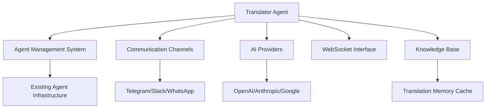
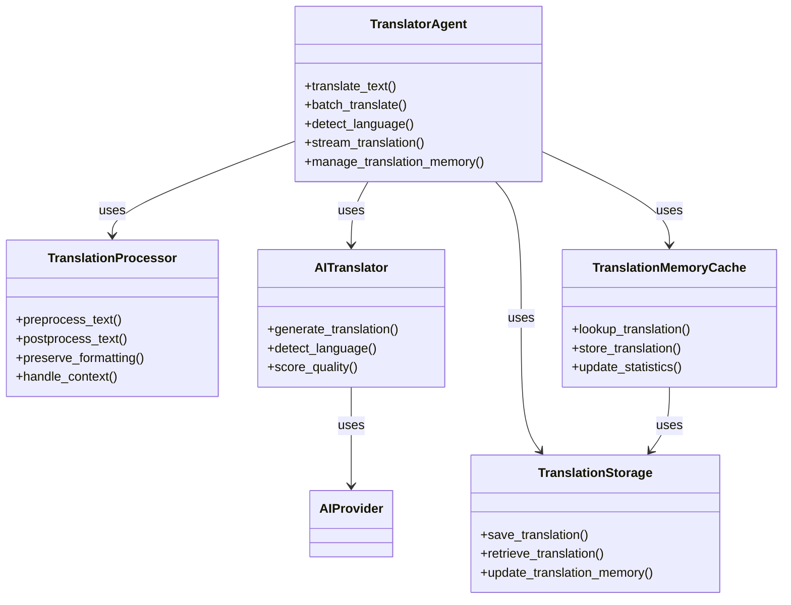
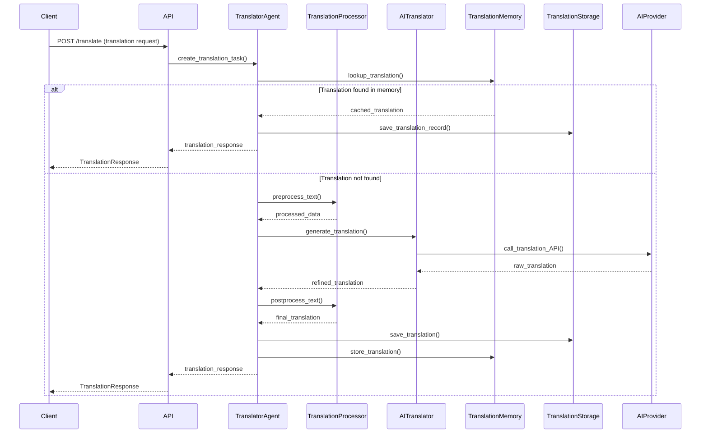

# Translator Agent Implementation Plan

## 1. Overview

The Translator Agent is a specialized subagent designed to provide multi-language support capabilities within the Chronos AI Agent Builder Studio. This agent will enable real-time and batch translation of text content across multiple languages, supporting both agent-to-human and agent-to-agent communication scenarios.

## 2. Core Functionalities

### 2.1 Primary Capabilities

- **Real-time Text Translation**: Translate text content between multiple languages in real-time
- **Batch Translation**: Process multiple text segments simultaneously for efficiency
- **Language Detection**: Automatically detect source language when not specified
- **Multi-language Support**: Support for 50+ major languages and dialects
- **Context-aware Translation**: Maintain context across conversation threads for better accuracy
- **Format Preservation**: Preserve formatting (markdown, HTML, etc.) during translation
- **Translation Memory**: Cache frequent translations for improved performance

### 2.2 Advanced Features

- **Domain-specific Translation**: Support for technical, medical, legal, and other specialized domains
- **Translation Quality Scoring**: Provide confidence scores for generated translations
- **Bulk Document Translation**: Process entire documents while maintaining structure
- **Real-time Translation Streaming**: Stream translations as they're generated
- **Custom Translation Rules**: Allow users to define preferred terminology and style guides
- **Language Variant Support**: Handle regional variations (e.g., US vs UK English, Latin American vs European Spanish)

## 3. System Integration

### 3.1 Integration Points



### 3.2 Integration Strategy

1. **Agent Type Extension**: Add `agent_type` field to distinguish Translator Agents from regular agents
2. **Specialized Endpoints**: Create dedicated API endpoints for translation operations
3. **Event-driven Architecture**: Use WebSocket events for real-time translation streaming
4. **AI Provider Integration**: Extend existing AI provider system with translation-specific capabilities
5. **Communication Channel Hooks**: Integrate with existing communication channels for automatic translation
6. **Knowledge Base Integration**: Store translation memory and frequently used translations

## 4. API Specifications

### 4.1 New Endpoints

#### Translator Agent Management
- `POST /api/v1/agents/translator` - Create a new Translator Agent
- `GET /api/v1/agents/translator` - List user's Translator Agents
- `GET /api/v1/agents/translator/{agent_id}` - Get specific Translator Agent details

#### Translation Operations
- `POST /api/v1/translate/{agent_id}/translate` - Translate text content
- `POST /api/v1/translate/{agent_id}/batch` - Batch translate multiple text segments
- `POST /api/v1/translate/{agent_id}/detect-language` - Detect language of text
- `GET /api/v1/translate/{agent_id}/supported-languages` - Get supported languages
- `POST /api/v1/translate/{agent_id}/stream` - Stream translation in real-time

#### Translation Memory
- `POST /api/v1/translate/{agent_id}/memory` - Add to translation memory
- `GET /api/v1/translate/{agent_id}/memory` - Search translation memory
- `DELETE /api/v1/translate/{agent_id}/memory` - Clear translation memory

### 4.2 WebSocket Events

- `translator:start` - Start translation session
- `translator:progress` - Real-time translation progress updates
- `translator:complete` - Translation completed
- `translator:error` - Translation error occurred
- `translator:stream` - Translation stream chunk available

### 4.3 Request/Response Examples

**Translation Request:**
```json
{
  "text": "Hello, how are you today?",
  "source_language": "en",
  "target_language": "es",
  "domain": "general",
  "preserve_formatting": true,
  "use_translation_memory": true,
  "context": "Friendly conversation between colleagues"
}
```

**Translation Response:**
```json
{
  "translation_id": "trans_123456789",
  "source_text": "Hello, how are you today?",
  "translated_text": "¡Hola, ¿cómo estás hoy?",
  "source_language": "en",
  "target_language": "es",
  "confidence_score": 0.95,
  "domain": "general",
  "processing_time_ms": 450,
  "translation_memory_used": true,
  "created_at": "2026-01-04T16:30:00Z"
}
```

**Batch Translation Request:**
```json
{
  "texts": [
    "Hello world",
    "Good morning",
    "Thank you"
  ],
  "source_language": "en",
  "target_language": "fr",
  "domain": "general"
}
```

## 5. Data Models

### 5.1 Database Schema Extensions

#### TranslatorAgent Model (extends AgentModel)
```python
class TranslatorAgent(AgentModel):
    __tablename__ = "translator_agents"
    
    # Translation-specific configuration
    agent_id = Column(Integer, ForeignKey("agents.id"), primary_key=True)
    default_source_language = Column(String(10), default="auto")  # auto or language code
    default_target_language = Column(String(10), default="en")
    default_domain = Column(String(50), default="general")  # general, technical, medical, etc.
    preserve_formatting = Column(Boolean, default=True)
    use_translation_memory = Column(Boolean, default=True)
    min_confidence_threshold = Column(Float, default=0.8)
    
    # Performance metrics
    avg_processing_time = Column(Float, default=0.0)
    avg_confidence_score = Column(Float, default=0.0)
    total_translations = Column(Integer, default=0)
    translation_memory_hits = Column(Integer, default=0)
    
    # Relationships
    agent = relationship("AgentModel", back_populates="translator_config")
    translations = relationship("TranslationRecord", back_populates="translator_agent")
    translation_memory = relationship("TranslationMemory", back_populates="translator_agent")
```

#### TranslationRecord Model
```python
class TranslationRecord(BaseModel):
    __tablename__ = "translation_records"
    
    # Translation content
    source_text = Column(Text, nullable=False)
    translated_text = Column(Text, nullable=False)
    source_language = Column(String(10), nullable=False)
    target_language = Column(String(10), nullable=False)
    confidence_score = Column(Float, nullable=False)
    domain = Column(String(50), default="general")
    
    # Metadata
    original_length = Column(Integer)  # characters
    translated_length = Column(Integer)  # characters
    processing_time_ms = Column(Integer)
    translation_memory_used = Column(Boolean, default=False)
    
    # Context
    context = Column(Text, nullable=True)
    tags = Column(JSON, nullable=True)
    
    # Relationships
    agent_id = Column(Integer, ForeignKey("agents.id"))
    translator_agent_id = Column(Integer, ForeignKey("translator_agents.agent_id"))
    
    agent = relationship("AgentModel")
    translator_agent = relationship("TranslatorAgent")
```

#### TranslationMemory Model
```python
class TranslationMemory(BaseModel):
    __tablename__ = "translation_memory"
    
    # Translation pair
    source_text = Column(Text, nullable=False)
    translated_text = Column(Text, nullable=False)
    source_language = Column(String(10), nullable=False)
    target_language = Column(String(10), nullable=False)
    domain = Column(String(50), default="general")
    
    # Usage statistics
    usage_count = Column(Integer, default=1)
    last_used_at = Column(DateTime, onupdate=datetime.utcnow)
    
    # Quality metrics
    confidence_score = Column(Float, nullable=False)
    user_rating = Column(Float, nullable=True)  # 1-5 stars
    
    # Relationships
    translator_agent_id = Column(Integer, ForeignKey("translator_agents.agent_id"))
    translator_agent = relationship("TranslatorAgent")
    
    # Indexes for faster lookup
    __table_args__ = (
        Index('idx_source_target_domain', 'source_text', 'target_language', 'domain'),
    )
```

### 5.2 Pydantic Schemas

#### TranslatorAgentCreate
```python
class TranslatorAgentCreate(AgentCreate):
    default_source_language: str = "auto"
    default_target_language: str = "en"
    default_domain: str = "general"
    preserve_formatting: bool = True
    use_translation_memory: bool = True
    min_confidence_threshold: float = 0.8
```

#### TranslationRequest
```python
class TranslationRequest(BaseModel):
    text: str
    source_language: Optional[str] = "auto"
    target_language: str
    domain: str = "general"
    preserve_formatting: bool = True
    use_translation_memory: bool = True
    context: Optional[str] = None
    tags: Optional[List[str]] = None
```

#### TranslationResponse
```python
class TranslationResponse(BaseModel):
    translation_id: str
    source_text: str
    translated_text: str
    source_language: str
    target_language: str
    confidence_score: float
    domain: str
    processing_time_ms: int
    translation_memory_used: bool
    created_at: datetime
    metadata: Optional[Dict[str, Any]]
```

#### BatchTranslationRequest
```python
class BatchTranslationRequest(BaseModel):
    texts: List[str]
    source_language: Optional[str] = "auto"
    target_language: str
    domain: str = "general"
    preserve_formatting: bool = True
    context: Optional[str] = None
```

## 6. Technical Architecture

### 6.1 Component Diagram



### 6.2 Sequence Diagram



### 6.3 Implementation Layers

1. **API Layer**: FastAPI endpoints for translation operations
2. **Service Layer**: Business logic and orchestration
3. **Processing Layer**: Text preprocessing and postprocessing
4. **AI Layer**: Integration with AI providers for translation
5. **Storage Layer**: Database operations and translation memory management
6. **Integration Layer**: Communication with other system components

## 7. Implementation Steps

### 7.1 Phase 1: Foundation

1. **Database Schema Updates**
   - Add `agent_type` field to `AgentModel`
   - Create `TranslatorAgent` extension table
   - Create `TranslationRecord` table
   - Create `TranslationMemory` table

2. **Core Models Implementation**
   - Implement SQLAlchemy models
   - Create Pydantic schemas
   - Add validation logic

3. **Basic API Endpoints**
   - Create translator agent CRUD endpoints
   - Implement basic translation endpoint
   - Add error handling and validation

### 7.2 Phase 2: Core Functionality

1. **Translation Processing**
   - Text preprocessing (cleaning, normalization)
   - Format preservation logic
   - Context handling

2. **AI Integration**
   - OpenAI translation API integration
   - Google Cloud Translation API integration
   - Anthropic API integration
   - Fallback mechanisms

3. **Translation Generation**
   - Language detection
   - Quality scoring
   - Confidence threshold handling

### 7.3 Phase 3: Advanced Features

1. **Real-time Translation**
   - WebSocket integration
   - Streaming translation updates
   - Progress tracking

2. **Translation Memory System**
   - Memory lookup and storage
   - Usage statistics tracking
   - Cache management

3. **Batch Processing**
   - Bulk translation capabilities
   - Performance optimization
   - Error handling for partial failures

### 7.4 Phase 4: Integration & Testing

1. **System Integration**
   - Communication channel hooks
   - Agent management integration
   - WebSocket event system
   - Knowledge base integration

2. **Testing**
   - Unit tests for all components
   - Integration tests
   - Performance testing
   - User acceptance testing

3. **Documentation**
   - API documentation
   - User guides
   - Technical documentation

## 8. Dependencies

### 8.1 Existing System Dependencies

- `AgentModel` and agent management system
- `AIProvider` integration layer
- WebSocket communication system
- Authentication and authorization system
- Knowledge base system

### 8.2 New Dependencies

- `google-cloud-translate` (for Google Translation API)
- `langdetect` (for language detection)
- `python-Levenshtein` (for text similarity in translation memory)
- Additional AI provider SDKs as needed

### 8.3 External Services

- OpenAI API (for translation)
- Google Cloud Translation API (primary translation service)
- Anthropic API (alternative provider)
- Optional: DeepL API for high-quality translations

## 9. Configuration

### 9.1 Environment Variables

```env
# Translator Agent Configuration
TRANSLATOR_DEFAULT_SOURCE_LANG="auto"
TRANSLATOR_DEFAULT_TARGET_LANG="en"
TRANSLATOR_DEFAULT_DOMAIN="general"
TRANSLATOR_MIN_CONFIDENCE=0.8
TRANSLATOR_ENABLE_MEMORY=true
TRANSLATOR_MAX_TEXT_LENGTH=5000
TRANSLATOR_TIMEOUT_SECONDS=30

# AI Provider Configuration
GOOGLE_TRANSLATE_API_KEY="your-api-key"
OPENAI_API_KEY="your-api-key"
ANTHROPIC_API_KEY="your-api-key"
DEEPL_API_KEY="your-api-key"
TRANSLATOR_FALLBACK_PROVIDER="google"

# Translation Memory Configuration
TRANSLATION_MEMORY_MAX_ENTRIES=10000
TRANSLATION_MEMORY_MIN_USAGE_THRESHOLD=3
```

### 9.2 Agent Configuration

```json
{
  "translator_agent": {
    "default_settings": {
      "source_language": "auto",
      "target_language": "en",
      "domain": "general",
      "preserve_formatting": true,
      "use_translation_memory": true,
      "min_confidence_threshold": 0.8
    },
    "advanced_settings": {
      "enable_domain_specific": true,
      "enable_quality_scoring": true,
      "enable_streaming": false,
      "max_retries": 2,
      "fallback_provider": "google"
    },
    "supported_languages": [
      "en", "es", "fr", "de", "it", "pt", "ru", "zh", "ja", "ko", "ar", "hi"
    ],
    "supported_domains": [
      "general", "technical", "medical", "legal", "financial", "marketing"
    ]
  }
}
```

## 10. Error Handling

### 10.1 Error Types

- `TRANSLATION_TOO_LONG`: Input exceeds maximum length
- `UNSUPPORTED_LANGUAGE`: Language not supported
- `UNSUPPORTED_LANGUAGE_PAIR`: Language combination not supported
- `AI_PROVIDER_ERROR`: AI service failure
- `PROCESSING_TIMEOUT`: Translation took too long
- `LOW_CONFIDENCE`: Translation confidence below threshold
- `STORAGE_ERROR`: Failed to save translation
- `MEMORY_LOOKUP_ERROR`: Translation memory lookup failed

### 10.2 Error Response Format

```json
{
  "error": {
    "code": "TRANSLATION_PROCESSING_ERROR",
    "message": "Failed to process translation request",
    "details": {
      "input_length": 5000,
      "max_allowed": 10000,
      "source_language": "en",
      "target_language": "xx",
      "suggested_action": "Check target language code or split text into smaller chunks"
    },
    "timestamp": "2026-01-04T16:30:00Z"
  }
}
```

## 11. Performance Considerations

### 11.1 Optimization Strategies

- **Caching**: Cache frequent translations in memory
- **Batching**: Process multiple translations in batches when possible
- **Parallel Processing**: Use async for independent translation operations
- **Provider Selection**: Use appropriate AI models based on language pair and domain
- **Rate Limiting**: Implement API call rate limiting
- **Translation Memory**: Reuse high-quality translations

### 11.2 Performance Metrics

- **Processing Time**: Target < 500ms for short translations, < 2s for long translations
- **Memory Usage**: Monitor and optimize memory consumption
- **API Call Efficiency**: Minimize external API calls through caching
- **Concurrency**: Support multiple simultaneous translation requests
- **Translation Memory Hit Rate**: Target > 30% for frequent users

## 12. Security Considerations

### 12.1 Data Protection

- **Input Sanitization**: Clean text content before processing
- **Access Control**: Ensure proper agent ownership verification
- **Data Isolation**: Prevent cross-user data leakage
- **API Key Security**: Secure AI provider credentials
- **Rate Limiting**: Prevent abuse of translation services

### 12.2 Privacy Compliance

- **Data Retention**: Configurable translation retention policies
- **Anonymization**: Option to anonymize sensitive content
- **GDPR Compliance**: Support for data deletion requests
- **Audit Logging**: Track translation activities
- **Content Filtering**: Block inappropriate or sensitive content

## 13. Monitoring and Analytics

### 13.1 Key Metrics

- **Usage Statistics**: Number of translations generated
- **Performance Metrics**: Average processing time
- **Quality Metrics**: Average confidence scores
- **Error Rates**: Frequency of processing failures
- **User Feedback**: Translation usefulness ratings
- **Translation Memory Efficiency**: Hit rate and performance impact
- **Language Distribution**: Most frequently translated language pairs

### 13.2 Monitoring Tools

- **Logging**: Detailed operation logs with translation metadata
- **Alerting**: Notifications for critical failures or quality issues
- **Dashboard**: Visualization of key metrics and usage patterns
- **Export**: Data export for analysis and reporting
- **Quality Monitoring**: Track confidence scores and user ratings over time

## 14. Future Enhancements

### 14.1 Roadmap Items

1. **Multi-modal Translation**: Support for audio/video content translation
2. **Custom Model Training**: Domain-specific translation models
3. **Collaborative Translation**: Multiple agents working together for complex content
4. **Automatic Quality Improvement**: Feedback-driven refinement of translation memory
5. **Cross-lingual Summarization**: Translate and summarize simultaneously
6. **Visual Translation**: Image and document layout preservation
7. **Real-time Conversation Translation**: Live translation for chat and voice
8. **Language Style Transfer**: Adapt translations to specific writing styles

## 15. Implementation Timeline

### 15.1 Suggested Phases

```
Phase 1: Foundation (Core infrastructure)
  - Database schema and models
  - Basic API endpoints
  - Core translation logic
  - AI provider integration

Phase 2: Core Features (Main functionality)
  - Advanced processing capabilities
  - Translation memory system
  - Batch processing
  - Quality scoring and confidence thresholds

Phase 3: Advanced Features (Enhanced capabilities)
  - Real-time streaming
  - Domain-specific translation
  - Format preservation
  - Context-aware translation

Phase 4: Integration & Testing (System integration)
  - Communication channel integration
  - WebSocket implementation
  - Comprehensive testing
  - Performance optimization

Phase 5: Deployment & Monitoring (Production readiness)
  - Staging deployment
  - User testing and feedback
  - Monitoring setup
  - Production rollout
```

## 16. Success Criteria

### 16.1 Technical Success

- ✅ All API endpoints functional and documented
- ✅ Integration with existing agent system complete
- ✅ Real-time translation working with WebSocket
- ✅ Translation memory system operational
- ✅ Comprehensive test coverage (>80%)
- ✅ Performance targets met (<500ms average response for short text)
- ✅ Support for 50+ languages
- ✅ 90%+ translation memory hit rate for repeated content

### 16.2 User Success

- ✅ Intuitive user interface for translation management
- ✅ High-quality, accurate translations
- ✅ Positive user feedback on functionality and performance
- ✅ Successful adoption by target user base
- ✅ Minimal support requests post-launch
- ✅ Effective handling of domain-specific content

## 17. Risks and Mitigation

### 17.1 Key Risks

1. **AI Provider Limitations**: Rate limits, quality issues, language support
   - *Mitigation*: Multiple provider support, fallback mechanisms, local caching

2. **Performance Bottlenecks**: Slow processing with large inputs or complex content
   - *Mitigation*: Input chunking, batch processing, caching, provider optimization

3. **Translation Quality Variability**: Inconsistent translation quality across languages
   - *Mitigation*: Quality scoring, user feedback, continuous improvement, provider selection

4. **Integration Complexity**: Challenges with existing communication systems
   - *Mitigation*: Thorough testing, incremental integration, clear documentation

5. **Cost Management**: High API costs for frequent translations
   - *Mitigation*: Translation memory, caching, provider cost optimization, usage monitoring

6. **Language Coverage**: Limited support for less common languages
   - *Mitigation*: Prioritize based on user needs, clear documentation of supported languages

7. **Context Preservation**: Maintaining context in complex translations
   - *Mitigation*: Context-aware processing, session management, user feedback integration

## 18. Conclusion

The Translator Agent implementation will provide powerful multi-language support capabilities to the Chronos AI Agent Builder Studio. By leveraging existing infrastructure and following established patterns from the Summary Agent implementation, this feature can be integrated seamlessly while delivering significant value to users.

The phased approach ensures steady progress with opportunities for testing and refinement at each stage. The translation memory system and multi-provider support will optimize both performance and cost, while the comprehensive error handling and quality scoring will ensure reliable, high-quality translations.

This comprehensive plan addresses all aspects of the Translator Agent implementation, from core functionality to system integration, providing a clear roadmap for successful delivery that aligns with the overall project goals and existing architecture.